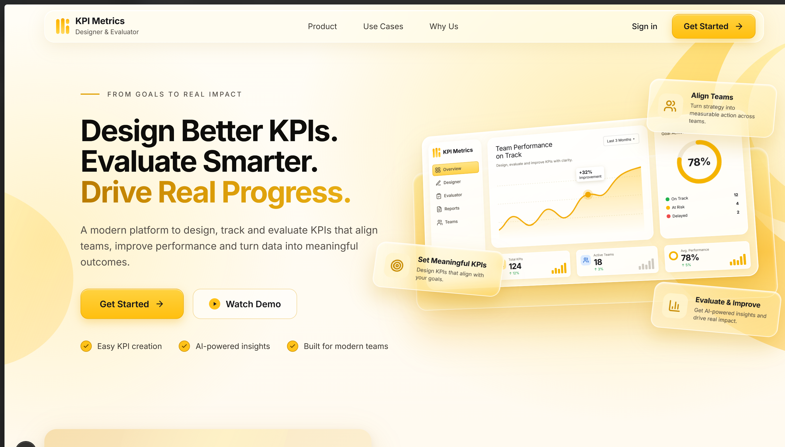
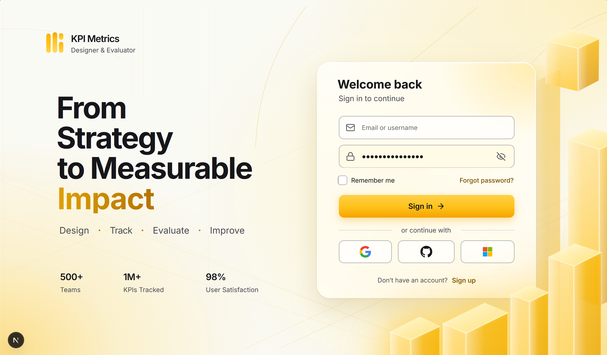
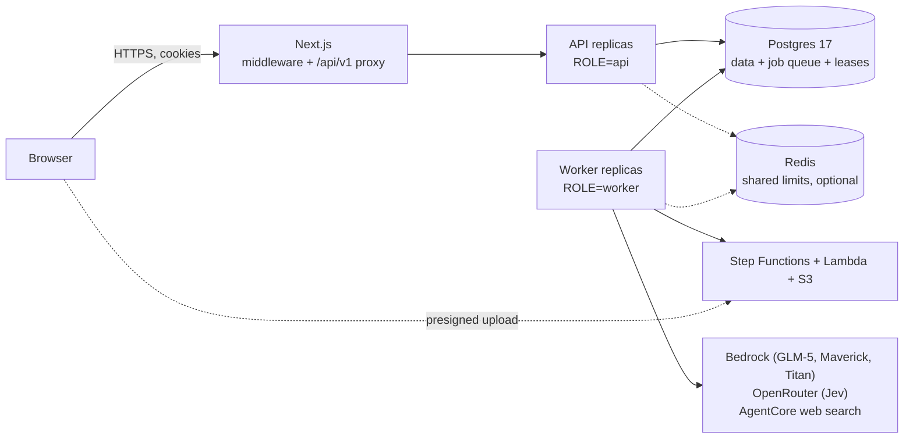

# Score Smith


**Score Smith** (formerly "KPI Metrics" / Quality Scorecard System; the app sidebar still reads "Quality Scorecards") is a generic scorecard creation and rating system, think Google Forms for quality
scorecards. A user *defines* what quality means for any domain (a weighted, hierarchical set of KPIs with 11-level qualitative and quantitative guidelines) through a chat-driven, research-grounded builder,
then applies it consistently: by hand, with an ensemble LLM judge, or with an AI pipeline that reads real submissions (videos, PDFs, Word documents, Google Drive folders, whole spreadsheets of them) and returns
a reasoned, evidence-cited, RAG-banded score. Teams share charts and chats, see each other's evaluations and get notified. It is built against TalenciaGlobal's Quality Scorecard Framework and
Data-Driven Development Framework (`References/`).

| Home page | Login page |
|---|---|
|  |  |

## Contents

[Features](#features) | [Architecture](#architecture) | [Quick start](#quick-start-development) | [Production checklist](#production-checklist) | [Scaling](#scaling-guide) |
[Roles and sharing](#roles-and-sharing) | [Commands](#common-commands) | [Troubleshooting](#troubleshooting) | [Tests and CI](#tests-and-ci) | [Docs](#documentation-map) | [Status](#status-and-limitations)

## Features

**Building scorecards**
- Chat-driven builder (LangGraph on AWS Bedrock, Z.ai GLM-5) that asks clarifying questions, researches KPIs with real web search in parallel per category, and checkpoints every step to Postgres.
- Open-ended, user-specified (your KPIs are kept exactly) and hybrid modes, chosen automatically; follow-up edits are small server-side operations ("make X 8% and scale the others").
- Hierarchical KPI trees (up to 4 levels, weights on leaves, Postgres `ltree`), custom scoring formulas (safe `simpleeval`), reuse suggestions via pgvector similarity.
- Chat turns run as background jobs with a live trace, cancel button and refresh-safe resume.

**Evaluating**
- Manual scoring, an ensemble LLM judge for pasted text, and an **AI pipeline** for real submissions: uploads and Drive links go through AWS Step Functions + Lambda (extract, transcribe, OCR), then Llama 4 Maverick selects evidence and Jev scores it.
- Spreadsheet batches (any column layout), queue with per-user fairness, progress, cancel, retry; infinite-scroll evaluations list with server-side filters, select-all-matching, bulk delete and Excel export.

**Teams and accounts**
- JWT auth (15-minute access token + rotating refresh token in httpOnly cookies, CSRF double-submit, reuse detection, lockout, rate limits, remember-me, forgot/reset/verify e-mail), Argon2id, optional OAuth (disabled until configured).
- Roles `admin` and `user`; admin Users page. Chart sharing by invitation (owner/editor, preview before accepting, re-sharing chains, editing log, optimistic concurrency), chat sharing (read-only), notifications bell, 30-day chart trash.
- Public marketing homepage at `/`, yellow/gold glass UI.

**Operations**
- `ROLE=api|worker|all`; workers claim jobs under leases and can be scaled out (`--scale worker=N`); cross-process cancel; retries; `Idempotency-Key`; shared Redis limits that fail open;
  `/health`, `/ready`, `/metrics` (backlog per worker); separate `migrate` release job; production startup validation.

Details of the AI behaviour (flows, quality gates, scoring accuracy, measured performance): [docs/ai-features.md](docs/ai-features.md).

## Architecture



The browser only talks to the Next.js origin. API replicas are stateless and only *enqueue* long work in Postgres; workers claim it with `SKIP LOCKED`, hold a lease, heartbeat it, and another worker adopts the job if one dies.
Full diagrams (system, evaluation and lease lifecycle, chat turn, auth and refresh, sharing state machine, ER model, frontend route map): **[docs/architecture.md](docs/architecture.md)**.
Provider split: chat, judge, master agent and embeddings use **AWS Bedrock** (configured through the Bedrock bearer token, see below); **Jev** (quality gates, routing, per-KPI scoring) is reached through **OpenRouter**;
S3 and Step Functions use a separate least-privilege IAM user (`AWS_APP_*`).

## Quick start (development)

Needs Docker with Compose. The AI features additionally need AWS Bedrock access; scorecard CRUD, manual evaluation, sharing and admin work without it.

```bash
cd infra
cp .env.example .env
# Edit .env. At minimum:
#   POSTGRES_PASSWORD   (python -c "import secrets; print(secrets.token_urlsafe(32))")
#   JWT_SECRET          (python -c "import secrets; print(secrets.token_urlsafe(48))")
#   ADMIN_EMAIL / ADMIN_PASSWORD   your first admin in development (a strong password; no real value is stored in the repo)
# For AI: AWS_REGION, AWS_ACCESS_KEY_ID, AWS_SECRET_ACCESS_KEY (Bedrock), optionally OPENROUTER_JEV_API and AGENTCORE_GATEWAY_*.
docker compose up --build -d
docker compose ps          # db, redis healthy; migrate Exited (0); backend, worker healthy; frontend Up
```

Open <http://localhost:3000>: the public homepage. Click **Sign in** and use the `ADMIN_EMAIL` / `ADMIN_PASSWORD` you set. In development you can also type the dev-only username from `ADMIN_USERNAME` (default `admin`)
instead of the e-mail; any user can also sign in with their username, or the part of their e-mail before the `@` if it is unique. Signed-in visitors who open `/` are sent straight to `/chat`; opening a protected page signed out sends you to `/login?next=...`.
Optional demo data: `docker compose exec backend python -m app.scripts.seed`.

| URL | What |
|---|---|
| <http://localhost:3000> | Web app (homepage, sign-in, app) |
| <http://localhost:8000> | API, loopback only (`/health`, `/ready`, interactive `/docs` in development) |
| `127.0.0.1:5432` | Postgres, loopback only |

AI evaluation of files and Drive links also needs the AWS stack from [aws/README.md](aws/README.md) (`aws/bootstrap.sh`), which fills `S3_BUCKET`, `SFN_STATE_MACHINE_ARN` and `AWS_APP_*` in `infra/.env`; then `docker compose up -d --build backend worker`.

**About the Bedrock credential.** If your Bedrock credential is a long-term *API key* (bearer token) rather than a SigV4 key pair, `docker-compose.yml` sets `AWS_BEARER_TOKEN_BEDROCK` to `A` + `AWS_SECRET_ACCESS_KEY`
(botocore prefers it for Bedrock). Plain keys of that kind fail with `UnrecognizedClientException`. Details in the comments of `infra/docker-compose.yml` and `infra/.env.example`.

More: [infra/README.md](infra/README.md) (services, ports, volumes, backups) and [docs/configuration.md](docs/configuration.md) (every environment variable).

## Production checklist

The compose file is a development stack. For a real deployment (plan: [docs/cloud_deployment_plan.md](docs/cloud_deployment_plan.md)):

1. `ENV=production` on **api and worker**. They refuse to start unless all of these hold: `JWT_SECRET` 32+ random characters; a random 12+ character database password in `DATABASE_URL`; secure cookies;
   explicit https `CORS_ORIGINS` and `FRONTEND_URL` (no localhost, no `*`); `EMAIL_BACKEND=ses` (+ `EMAIL_FROM`); docs off. `ADMIN_EMAIL` / `ADMIN_PASSWORD` are ignored (with a warning), and signup is off unless `SIGNUP_ENABLED=true`.
2. **Run the release job first**: `python -m app.scripts.migrate` (the `migrate` service). Do not run migrations in every container.
3. **First admin**: set a one-time `BOOTSTRAP_TOKEN` (32+ chars), then
   `curl -X POST https://HOST/api/v1/auth/register-user -H "Content-Type: application/json" -H "X-Bootstrap-Token: $BOOTSTRAP_TOKEN" -d '{"email":"admin@corp.com","name":"Admin","password":"<strong>"}'`
   (or open `/setup`). It works only while zero users exist; **remove the token afterwards**. Admins then create users from the Users page.
4. **Proxy and cookies**: terminate TLS in front of the Next.js app; set `FORWARDED_ALLOW_IPS` to the proxy addresses so per-IP rate limits and the audit log see real clients; keep the API on an internal address; leave `COOKIE_DOMAIN` empty.
5. **Redis**: set `REDIS_URL` for cluster-wide limits and shared rate limits (optional; everything fails open without it).
6. **Secrets** in a secrets manager, not in images or the repo; prefer IAM roles over keys for Bedrock and S3/Step Functions.
7. Use a production Next.js build for the frontend (`next build`/`next start`); the repo's frontend Dockerfile is dev mode.
8. Back up Postgres ([infra/README.md](infra/README.md#backups-and-restore)). Set `AUTOSCALE_METRIC_NAMESPACE` if you autoscale workers.

## Scaling guide

| Tier | How to scale | Notes |
|---|---|---|
| Frontend | Replicas behind a load balancer | Stateless; needs `INTERNAL_API_BASE_URL` |
| API (`ROLE=api`) | More containers / `WEB_CONCURRENCY` gunicorn workers | Stateless. Size DB pools: `(DB_POOL_SIZE + DB_MAX_OVERFLOW) x processes` below Postgres `max_connections` |
| Workers (`ROLE=worker`) | `docker compose up -d --scale worker=N` (compose default is **one**) | Add workers for chat-turn capacity and failover; they coordinate through Postgres leases (`LEASE_SECONDS=60`, heartbeat 15 s) |
| Postgres | Vertical / managed (Aurora) | System of record and job queue |
| Redis | Optional | Shared Bedrock / Jev / search concurrency (`*_GLOBAL_CONCURRENCY`) and rate-limit counters |

Hard limits that more workers do **not** lift: at most `AI_EVAL_MAX_CONCURRENT` (1-5) evaluations run cluster-wide; each user has **one** running evaluation job (a batch counts as one) and **one** running chat turn
(`409 user_job_active` / `user_chat_active`); AWS Lambda and Bedrock account quotas. The autoscaling signal is **backlog per worker** = (queued + active evaluations + waiting chat turns) / workers, served by the worker's
`GET :8001/metrics` and, with `AUTOSCALE_METRIC_NAMESPACE`, published as the CloudWatch metric `BacklogPerWorker`. A worker that receives SIGTERM drains: it stops claiming, lets chat turns finish
(`WORKER_DRAIN_GRACE_SECONDS`), and releases evaluation leases so peers resume them at once.

## Roles and sharing

| | `user` | `admin` |
|---|---|---|
| Own charts, chats, evaluations | yes | yes |
| Shared charts (as editor), shared chats (read-only) | yes | yes |
| Users page (create, edit, role, password, deactivate / reactivate, delete = anonymise), Settings | no | yes |
| See other people's private data | no | **no** (no bypass; admins only see what is shared with them) |

- **Chart sharing**: the owner and every editor can invite people by username or e-mail (chains work). The invitee gets a notification, can **preview** the chart read-only, then accept or decline. Editors edit the chart and see
  every evaluation on it; only the owner removes people or moves the chart to the trash. Concurrent edits are guarded (`If-Match` -> `409 stale_edit`); an editing log shows who did what.
- **Chat sharing**: read-only, either "only the chat" (the recipient can save their own copy) or "chat and chart" (also a chart invitation). Recipients can pass it on, read-only.
- **Trash**: deleting a chart moves it to the owner's trash for 30 days (`TRASH_RETENTION_DAYS`); jobs running on it are cancelled and resumed on restore when the runner's slot is free.
- Full matrix, invitation state machine and notification catalogue: [docs/plan-sharing-rbac.md](docs/plan-sharing-rbac.md) and [docs/architecture.md](docs/architecture.md#5-sharing-and-permissions).

## Common commands

Run from `infra/` unless noted.

| Task | Command |
|---|---|
| Start / stop | `docker compose up -d` / `docker compose down` (keeps data; `down -v` deletes the database volume) |
| Logs | `docker compose logs -f backend worker` |
| More workers | `docker compose up -d --scale worker=3` |
| Apply migrations only | `docker compose run --rm migrate` |
| Restart after backend edits (no auto-reload on purpose) | `docker compose restart backend worker` |
| Frontend not seeing edits | `docker compose restart frontend` |
| Reset an account's password | `docker compose exec backend python -m app.scripts.set_password <email>` |
| Share everything with one user | `docker compose exec backend python -m app.scripts.share_everything --to <handle> --dry-run` |
| Delete leftover test users | `docker compose exec backend python -m app.scripts.purge_users --pattern 'e2e-%@example.com'` (dry run; add `--yes` to delete) |
| Backend tests (from `backend/`) | `python -m pytest` (see [backend/README.md](backend/README.md#tests)) |
| Frontend checks (from `frontend/`) | `npx tsc --noEmit && npm run lint && npm run test:unit` |

## Troubleshooting

| Symptom | What to do |
|---|---|
| Frontend does not hot-reload on Windows / Docker Desktop | File events from the host do not always reach the container: `docker compose restart frontend` (or set `WATCHPACK_POLLING=true` on the service). Backend code is never auto-reloaded: `docker compose restart backend worker` |
| `409 user_job_active` / `user_chat_active` ("You already have an evaluation / chat turn running") | Per-user slots: one running evaluation job (a batch is one) and one chat turn. Wait, or cancel the running one. If nothing is actually running, check `docker compose ps worker`; a dead worker's job is adopted after the 60 s lease expires |
| Chat turn or evaluation stays "queued" | No worker is running (`docker compose up -d worker`) or `AI_EVAL_MAX_CONCURRENT` evaluations are already active |
| `tsc` / `next build` errors about files that no longer exist | Stale generated types in `.next/types`: `docker compose exec frontend rm -rf .next/types` (host: `rm -rf frontend/.next/types`) and run again |
| Redis is down | Harmless by design: Bedrock / Jev / search limits fall back to per-process, rate limits to in-memory; `/ready` shows `redis: down`. Fix Redis when convenient |
| `429` after several logins | Login is limited to 10/minute per IP (`RATE_LIMIT_LOGIN`) and per address; 5 wrong passwords lock the account for 5 minutes, doubling up to 60 (`set_password` clears a lock). Wait for `Retry-After`; in development you can clear the counters with `docker compose exec redis redis-cli flushall` |
| `Set POSTGRES_PASSWORD in infra/.env` | Required variables are missing; see [Quick start](#quick-start-development) |
| `password authentication failed` after editing `POSTGRES_PASSWORD` | Postgres reads the password only when the volume is created; restore the original value or `ALTER USER` inside the container |
| Sessions end whenever the backend restarts | `JWT_SECRET` is unset, so each process uses an ephemeral key. Set it in `.env` |
| AI features return a Bedrock-unavailable error | Check the Bedrock credential and `AWS_REGION`; see the credential note in [Quick start](#quick-start-development) |

## Tests and CI

- **Backend**: ~900 pytest tests against a real Postgres (a separate `quality_scorecard_test` database, never the dev one) with fake Bedrock / Jev / search / AWS clients; optional `TEST_REDIS_URL` for the live Redis tests. How to run them safely: [backend/README.md](backend/README.md#tests).
- **Frontend**: `tsc`, ESLint, `node --test` unit tests, production build; Playwright smoke tools in `frontend/tools/` ([frontend/README.md](frontend/README.md#tests-and-tools)).
- **Lambda workers**: `cd aws/lambdas && python -m pytest`.
- **Live checks against a running stack** (real model calls, cost money, stdlib only; they sign in through `POST /auth/login`, so give them an account with a password and the password in the environment, never on the command line):
  `QS_EMAIL=you@example.com QS_PASSWORD=... python scripts/e2e_chat_check.py --test 1` (builder checks: exact KPI names kept, weights sum to 100, 11 guidelines per leaf; `--test 2`, `--test all`, `--keep`),
  and `EVAL_EMAIL=... EVAL_PASSWORD=... python scripts/run_batch_evaluations.py --dry-run` (uploads folders from `scripts/GdriveDownload/` and evaluates them in waves; also `--check`, `--resume`, `--list-scorecards`).
- **CI** (`.github/workflows/`): backend (Postgres + Redis services, migrations, `pytest`, `ruff`) and frontend (`tsc`, lint, unit tests, build).

## Documentation map

| Document | Contents |
|---|---|
| [docs/architecture.md](docs/architecture.md) | All diagrams: system, evaluation lease lifecycle, chat turn, auth, sharing, ER model, route map, flow narratives |
| [docs/api-reference.md](docs/api-reference.md) | Route table by area with access rules, error codes |
| [docs/configuration.md](docs/configuration.md) | Every environment variable with default and purpose |
| [docs/ai-features.md](docs/ai-features.md) | Chat builder, AI evaluation pipeline, scoring accuracy, performance, limits |
| [docs/plan-sharing-rbac.md](docs/plan-sharing-rbac.md) | Sharing, notifications, trash, RBAC, slots: design and permission matrix |
| [docs/cloud_deployment_plan.md](docs/cloud_deployment_plan.md) | Moving to AWS: api/worker split, Redis, migrate job, autoscaling, secrets |
| [docs/ai-eval-contract.md](docs/ai-eval-contract.md) | S3 layout and JSON contract of the evaluation pipeline |
| [docs/data_dictionary.md](docs/data_dictionary.md) | Column-level data dictionary |
| [docs/initial_product_scope.md](docs/initial_product_scope.md), [docs/cycle_2_3_plan.md](docs/cycle_2_3_plan.md) | Scope and the deferred Cycle 2 / 3 plan |
| [backend/README.md](backend/README.md), [frontend/README.md](frontend/README.md), [infra/README.md](infra/README.md), [aws/README.md](aws/README.md) | Per-component guides |

## Project structure

```
ScoreSmith/
├── backend/    FastAPI + SQLAlchemy + LangGraph + boto3; app/{api/v1,auth,ai,pipeline,models,schemas,scripts,limits}, alembic/, tests/
├── frontend/   Next.js 15 App Router: app/{(marketing),(auth),(app)}, components/, lib/, middleware.ts, tests/, tools/
├── infra/      docker-compose.yml, .env.example, db-init/
├── aws/        Serverless evaluation stack: bootstrap/deploy/teardown scripts, Step Functions ASL, IAM policies, lambdas/
├── docs/       Architecture, API, configuration and design documents
├── scripts/    e2e_chat_check.py and the standalone extraction tools the Lambdas were ported from
└── References/ Source framework PDFs
```

## Tech stack

| Layer | Technology |
|---|---|
| Backend | Python 3.12, FastAPI, SQLAlchemy 2.0 (async), Alembic, `psycopg` v3, Pydantic v2, gunicorn + uvicorn |
| Agents / LLMs | LangGraph with Postgres checkpoints; AWS Bedrock (GLM-5 chat, GLM-4.7-Flash judge, Llama 4 Maverick master, Titan embeddings); Jev via OpenRouter; AgentCore Gateway web search |
| Evaluation processing | S3 + Step Functions + six Lambda functions (PyMuPDF, python-docx, ffmpeg, Voxtral, vision OCR) |
| Data | PostgreSQL 17 with `pgvector` and `ltree`; Redis 7 (optional) |
| Auth | Argon2id, JWT access tokens, rotating refresh tokens, `limits` rate limiting |
| Frontend | Next.js 15, React 19, TypeScript, Tailwind CSS 4, shadcn/ui on Radix, Recharts, TanStack Table |
| Local infra | Docker Compose: `db`, `redis`, `migrate`, `backend`, `worker`, `frontend` |
| Quality | `ruff`, `pytest`, ESLint, `tsc`, `node --test`, Playwright smoke tools |

## Status and limitations

This build covers **Phase 0 + Cycle 1** of the Data-Driven Development Framework plus the work that followed (authentication, RBAC, sharing, scaling). **Deferred** (scoped in [docs/cycle_2_3_plan.md](docs/cycle_2_3_plan.md)):
Cycle 2 flawed-data and migration hardening; Cycle 3 scorecard `draft -> published -> archived` enforcement, the QTC gate, Red-diagnosis tracking, and a human review workflow for `needs_review` KPIs.

Known limits:
- No Row-Level Security or multi-tenant orgs: access control is enforced in the application (`app/authz.py`). OAuth buttons stay disabled until client ids are configured, and the provider round-trips have not been run against live providers.
- The weight-sum-to-100 rule is a deferred DB trigger that fires at commit, so KPI groups are created through the bulk endpoints.
- No automated browser-test suite in CI; live-update behaviour was checked by hand and with the Playwright tools.
- Polling re-fetches the whole chat session each time (an ETag/`?after=` optimisation is not built).
- Chat builder and AI pipeline limits (public Drive links only, supported file types, Jev being an alpha API, KPI-name edits verified heuristically, ...) are listed in [docs/ai-features.md](docs/ai-features.md#limits-of-the-chat-builder-and-the-evaluation-pipeline).
- Cancelling a chat turn stops new calls from being scheduled; Bedrock calls already in flight finish on their own.
