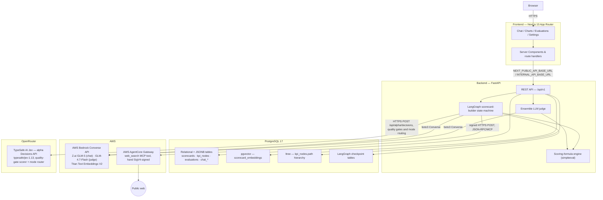
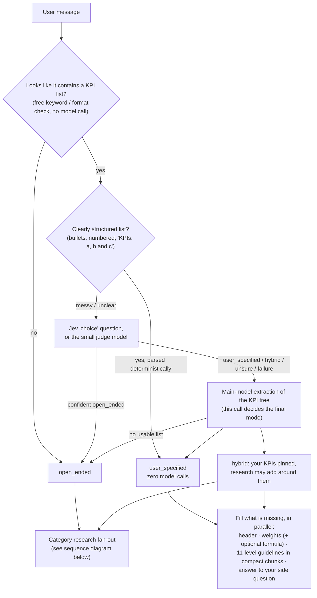
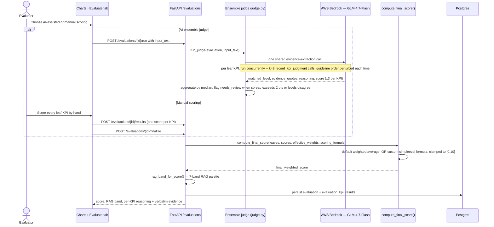

# ScoreSmith


**ScoreSmith** (working title: Quality Scorecard System) is a generic scorecard creation & rating system — think Google Forms, but for quality scorecards. Instead of hard-coding one fixed rubric for one fixed type of work, ScoreSmith lets a user *define* what quality means for any domain (a weighted, hierarchical set of KPIs with 11-level qualitative + quantitative guidelines) through a chat-driven, research-grounded builder, then apply that definition consistently and repeatably — by a human or an ensemble LLM judge — to rate real inputs and get a reasoned, evidence-cited, RAG-banded score. It is built directly against TalenciaGlobal's Quality Scorecard Framework and Data-Driven Development Framework (`References/`), and the current build is explicitly scoped to Phase 0 + Cycle 1 of that framework (see [Status & roadmap](#status--roadmap)).

## Key features

- **Chat-driven scorecard builder** — a [LangGraph](https://github.com/langchain-ai/langgraph) state machine, backed by AWS Bedrock (Z.ai GLM-5), asks clarifying questions, proposes KPIs "LLM first, human second," and checkpoints every step to Postgres so a session survives a server restart mid-question.
- **Two ways to start a scorecard, chosen automatically** — if you describe a use case ("a quality scorecard for SRE incident response") the builder designs the KPIs for you (*open-ended mode*). If you paste your own KPI list with the use case, it **keeps your KPIs exactly as written** and only fills in what is missing (*user-specified mode*). A list plus "and suggest more" runs both (*hybrid mode*). See [How the chat decides what to do](#how-the-chat-decides-what-to-do).
- **Your KPIs are protected** — in user-specified and hybrid mode the builder never drops, renames, re-parents, dedupes or caps your KPIs, and never silently changes a weight or guideline *you* supplied. A later change is accepted only when your latest message actually asks for it (checked server-side, not left to the model). Weights you didn't give are filled in (research-informed risk/impact weighting, optionally with a suggested scoring formula); weights you gave are kept, and only rescaled — with a note — if they don't sum to 100.
- **Genuine multi-agent, CATEGORY-based research fan-out (open-ended mode)** — before the first KPI is ever proposed, the graph decides named, business-recognizable KPI categories for the user's domain (e.g. "Schedule", "Budget", "Quality" for a project-milestone scorecard), then runs one independent research agent per category *concurrently* (`asyncio.gather`, not sequentially), each with its own real web-search budget via an AWS Bedrock AgentCore Gateway MCP tool. Each agent proposes its **own** batch of grounded KPIs nested under its category; their 11-level guidelines are then written in parallel, compact chunks. A cross-category dedup/merge pass resolves near-duplicate KPI concepts (obvious duplicates deterministically, borderline pairs by one batched judge call) before the result is shown, grouped by category, both on screen and in the saved `kpi_nodes` hierarchy.
- **Dynamic KPI count, no fixed ceiling** — the number of KPIs follows the use case. Ask for "35 KPIs" (or "30-40", "forty") and the result lands within ±2 of that; if the task honestly doesn't support that many distinct, good KPIs it returns fewer and tells you why instead of padding. Only high safety limits apply (300 KPIs total, 60 per category, 24 categories).
- **Follow-up edits are one small operation** — "make Customer Satisfaction Score 8% and scale the others" is applied by the server (`edit_kpis`: set weight with proportional rebalance, rename, remove, add, move, regenerate one KPI's guidelines), so the model never has to re-type the whole scorecard. The reply is a server-built summary of what really changed.
- **Chat turns run in the background** — sending a message returns immediately (`202`); the UI polls the session and a live trace, so the draft header, your KPIs, weights and guidelines appear on screen as they are ready, with no refresh, an elapsed timer and a Cancel button. A refresh mid-turn resumes where it was.
- **Cheap request routing** — a free keyword/format check, then Jev's multiple-choice `choice` question (or the small judge model) decides the mode; only a confident "open-ended" skips the full extraction, and a clearly structured list is parsed with zero model calls.
- **Embedding-based reuse suggestions** — a new request is checked against existing scorecards (pgvector cosine similarity over Titan-embedded purpose text, threshold 0.75) and offered as "use as-is / adapt / start fresh" *before* generating from scratch.
- **Ensemble LLM judge** — every leaf KPI is scored by **3 independent** Bedrock Converse calls (Z.ai GLM-4.7-Flash) with the guideline rungs presented in a different order each time (ascending / descending / deterministic shuffle) to counter position bias, aggregated by median, and flagged `needs_review` when the calls disagree.
- **Reasoning-before-score judging** — the judge's tool schema forces `matched_level → evidence_quotes → reasoning → score`, so the model commits to a rubric level and cites verbatim evidence before it ever writes a number.
- **Custom scoring-formula engine** — the default weighted average can be overridden with an arbitrary safe expression (`kpi["Name"] * 0.6 + min(kpi["A"], kpi["B"]) * 0.4`, `+ - * / **`, `min/max/avg/mean/sqrt/abs`), parsed via `simpleeval`'s AST whitelist (no `eval`), used identically by both the AI judge and manual scoring paths so they can never disagree about what a score means.
- **Hierarchical KPI trees** — up to 4 levels deep, with weights on leaf KPIs only (categories/sections are unweighted groupings), stored as Postgres `ltree` materialized paths, each leaf carrying a full 0–10 qualitative + quantitative guideline ladder.
- **Live agent-execution trace** — every research agent and the orchestrator itself streams granular events (`started`, `searching`, `search_result`, `proposing_kpis`, `completed`, `quality_gate`/`quality_gate_retry`, ...) to a dedicated table, rendered live in the chat UI instead of a generic spinner.
- **Quality-gate self-critique layer (open-ended mode)** — three checkpoints in the chat pipeline (the master's KPI-category plan, each category research agent's finding, and `propose_kpis`'s final per-turn answer) are rated 0–1 by [TypeSafe AI's **Jev**](https://openrouter.ai/docs/guides/community/jev) — a "System One" non-autoregressive decision model reached via OpenRouter's alpha Decisions API, **not** AWS Bedrock — against a 0.75 threshold. Below threshold, a GLM-5 **advisor/critique** step first reads the task, the actual output and the Jev score and names the specific problems and a concrete fix; the step then retries once with that critique. The gate is bounded three ways: one revision, a 12 s timeout per Jev call, and a per-turn time budget (150 s) after which no further gate work starts — then the pipeline proceeds with its best attempt. It is skipped where it can't add value (your own KPIs, an already-complete draft, simple edits). An unreachable Jev degrades the gate to "passed" rather than blocking the pipeline on a third-party dependency.
- **Manual and AI-driven evaluation**, converging on one shared scoring computation and 7-band RAG (Red/Amber/Green) result.
- **Glassmorphism design system** (white + lemon yellow `#FFF700`), with an explicit glass-vs-solid rule: glass surfaces for chrome/cards/modals, solid panels for dense data (guideline matrices, KPI/weight tables).

## Architecture

### System overview



### How the chat decides what to do

On a session's first message (and on any later message that pastes a new KPI list) the builder first works out *what you gave it*, cheaply, before spending model time:



Every failure path falls back to `open_ended`, and a router answer other than a *confident* `open_ended` is never trusted on its own — it can only remove work, never replace the full extraction. `REQUEST_ROUTER=off` disables the router entirely.

**What "fill what is missing" means in user-specified mode**

| Piece | How it is produced |
|---|---|
| Name, purpose, domain, audience, target score | One small bounded call right after mode detection (deterministic fallback from your message if it fails), so the live preview shows them within seconds. Anything you stated yourself is never overwritten. |
| Weights | Yours are kept (rescaled proportionally, with a note, only if they don't sum to 100). Missing ones come from a single weighting step: risk/impact-based relative importance, grounded in a scoped web search when search is configured, otherwise equal shares. |
| Scoring formula | Suggested (e.g. `min`-based gating for compliance KPIs) only when your use case implies it, you gave no formula, and it validates and references every scored KPI. |
| 11-level guidelines | Written by concurrent agents in small compact chunks (see below), using scoped benchmark research per group of KPIs; a time budget drops research and falls back to model-knowledge rubrics rather than stalling. |
| Answer to your side question | Questions in your message ("…and why is this scorecard needed?") are answered by a dedicated bounded call that runs alongside the work, then shown before the closing question. |

**The first-turn reply is written by the server, not the model.** Once your KPIs, weights, guidelines and header are all in place, no further model step is needed: the server composes the reply itself — the answer to your side question, then a compact summary (KPI count, scorecard name and target, the five highest and three lowest weights with their real percentages, a note if any KPI only got a fallback rubric; capped at ~1,200 characters, never a per-KPI dump) — and pauses with a single "save as-is or adjust?" question card with option chips. A model step is kept only when something is missing or a scoring-formula hint is still unapplied. The same cap applies to follow-up edit summaries and to the server-forced pause. **One-question contract:** when a turn returns a question card, the saved message text never also contains a question, so the question appears exactly once (on reload too); turns with no card (conversational answers, edit summaries) carry exactly one closing question in their text.

**Compact rubrics.** Generation time is dominated by output tokens, so a KPI's rubric is requested in a terse shape — `metric`, `unit`, `direction`, 11 short level texts (≤ 20 words) and 11 numeric thresholds — and the full guideline object (with `quantitative_criteria = {metric, operator, value, unit}`) is rebuilt in code. A KPI is only accepted with exactly 11 distinct, non-empty levels; thresholds that are non-numeric or out of order are dropped (the text is kept); anything incomplete is re-requested in smaller chunks (full chunk → halves → single KPI → a clearly marked fallback rubric as a last resort). A draft with any leaf below 11 levels can never be confirmed or saved. Every KPI is asked for a measurable proxy metric (a rate, count, time, or reviewer score) — a KPI that still ends up with no numbers keeps its text with a "[proposed target — please validate]" marker rather than invented values.

### Chat-to-scorecard flow (the research fan-out in detail)

This is the **open-ended** path (and the research half of hybrid). The turn itself runs as a background task: the API answers `202` immediately and the UI follows progress by polling (see [Chat turns in the background](#chat-turns-in-the-background)).

```mermaid
sequenceDiagram
    actor User
    participant UI as Chat UI
    participant API as FastAPI /chat
    participant Graph as LangGraph orchestrator
    participant Sim as check_similarity
    participant Research as research_kpis (master)
    participant Agents as Category research agents (N, parallel)
    participant Search as AgentCore Gateway web_search
    participant Jev as Jev (OpenRouter quality gate)
    participant Propose as propose_kpis (GLM-5)
    participant DB as Postgres

    User->>UI: Describe the desired scorecard
    UI->>API: POST /chat/sessions/{id}/messages
    API-->>UI: 202 Accepted, turn_in_progress = true (the turn runs as a background task)
    API->>Graph: send_message (new turn or resume from interrupt)
    UI->>API: poll GET /chat/sessions/{id} and /turn-events until the turn ends
    Graph->>Sim: check_similarity — runs once per session
    Sim->>DB: pgvector cosine search over scorecard_embeddings
    alt similar scorecard found, similarity >= 0.75
        Sim-->>Graph: suggest_similar triggers interrupt()
        Graph-->>API: pause, return suggestions
        API-->>UI: "Use as-is / Adapt / Start fresh"
        UI->>API: user's choice, resumes the graph
    end
    Graph->>Research: research_kpis — runs once per session
    Research->>Research: decide_categories (GLM-5 picks named KPI categories sized to the domain / requested KPI count, e.g. Schedule/Budget/Quality)
    loop quality gate 1: category plan vs. request, up to 1 revision, inside a per-turn time budget
        Research->>Jev: rate_match(instruction=user request, answer=category plan)
        Jev-->>Research: 0-1 score
        Research->>Research: if below 0.75, GLM-5 advisor critiques the plan, retry uses the critique
        Research->>DB: emit_turn_event (quality_gate / quality_gate_retry)
    end
    par one research agent per category
        Research->>Agents: spawn a research agent via asyncio.gather
        Agents->>Search: web_search(query), up to 2 calls
        Search-->>Agents: real titles / URLs / snippets
        Agents->>Agents: record_research_finding
        loop quality gate 2: finding vs. assigned category, up to 1 revision, inside the same time budget
            Agents->>Jev: rate_match(instruction=category+focus, answer=finding)
            Jev-->>Agents: 0-1 score
            Agents->>Agents: if below 0.75, GLM-5 advisor critique feeds the retry
        end
        Agents->>Agents: propose_kpi_batch — KPI names, weights and rationales for THIS category (level=2/parent_name=category); 11-level guidelines are then written in parallel compact chunks
        Agents-->>Research: ResearchFinding + this category's proposed KPIs
    end
    Research->>Research: dedupe near-duplicates ACROSS categories (no fixed cap; high safety ceiling only), fold each category's relative importance into its KPIs' weights so leaf weights sum to 100 across the scorecard (categories themselves carry no weight)
    Research->>DB: emit_turn_event per actor (live trace UI)
    Research-->>Graph: merged category + KPI hierarchy written into draft.kpis
    Graph->>Propose: propose_kpis — reconcile the researched draft (force_tool_use)
    loop quality gate 3: final answer vs. request, up to 1 revision (skipped when the draft is already complete)
        Propose->>Jev: rate_match(instruction=conversation, answer=decision)
        Jev-->>Propose: 0-1 score
        Propose->>Propose: if below 0.75, GLM-5 advisor critique plus previous response feed the retry
        Propose->>DB: emit_turn_event (quality_gate / quality_gate_retry)
    end
    alt clarification needed
        Propose-->>Graph: ask_clarification triggers interrupt()
        Graph-->>API: pending question + chip options
        API-->>UI: show clarifying question
        UI->>API: user answers, resumes the graph
    else user confirms
        Propose->>Graph: update_draft(confirmed=true)
        Graph->>Graph: confirm node
        Graph->>DB: materialize_draft — writes Scorecard / ScorecardVersion / KpiNode / KpiGuideline
        Graph-->>API: saved scorecard reference
        API-->>UI: navigate to the Charts detail view
    end
```

### Chat turns in the background

A turn can take from seconds (a follow-up edit) to a few minutes (research plus guidelines for dozens of KPIs), so it never holds an HTTP request open.

| Endpoint | Behaviour |
|---|---|
| `POST /api/v1/chat/sessions` | Creates the session, saves your first message, starts the turn as a background task, returns **202** with `turn_in_progress: true`. |
| `POST /api/v1/chat/sessions/{id}/messages` | Same for a follow-up. **409** if a turn is already running on that session. |
| `GET /api/v1/chat/sessions/{id}` | Current state: `status`, `draft`, pending `question` (chips), `assistant_message`, `turn_in_progress`, `turn_error`, `turn_error_code` (`bedrock_unavailable`, `timeout`, `interrupted`, `cancelled`, `turn_failed`). **While a turn runs this returns an interim draft** — the scorecard header and your KPIs within seconds, weights and guidelines as each chunk finishes. |
| `GET /api/v1/chat/sessions/{id}/turn-events` | The live agent trace (`classifying`, `mode_detected`, `weighting`, `guidelines` "Wrote guidelines for 12/35", `timing` per phase, research-agent events, quality gates, errors). |
| `POST /api/v1/chat/sessions/{id}/cancel` | Stops the running turn (the session is kept; `turn_error_code = "cancelled"`). |
| `DELETE /api/v1/chat/sessions/{id}` | Cancels a running turn, then deletes the session. |

- **The frontend polls** (every ~1.2 s while a turn runs, slower in a hidden tab, exponential backoff with jitter on errors, one sequential watcher per open chat, aborted on unmount). Polling was chosen over SSE/WebSockets because all state is durable in Postgres — a refresh, a second tab or a backend restart simply resumes polling — and `EventSource` cannot send the `X-User-Id` header.
- **Safety nets:** a turn is capped at `CHAT_TURN_TIMEOUT_SECONDS` (default 900 s); on startup the server marks any turn that was running when it stopped as `interrupted`, and a graceful shutdown cancels running turns the same way.
- **Tests / scripts:** `?wait=true` (or `CHAT_TURNS_INLINE=true`) runs a turn inline and returns the final result, which is what the older API tests use.

### Evaluation flow (manual and AI ensemble, one shared computation)



## Tech stack

| Layer | Technology |
|---|---|
| Backend framework | FastAPI 0.115, Python 3.12, Uvicorn |
| ORM / migrations | SQLAlchemy 2.0 (async), Alembic, `psycopg[binary]` v3 |
| Validation | Pydantic v2 / pydantic-settings |
| Agent orchestration | LangGraph 1.2 + `langgraph-checkpoint-postgres` (Postgres-backed checkpointing) |
| LLM access | boto3 → AWS Bedrock Converse/ConverseStream API |
| Chat / builder model | Z.ai GLM-5 (`zai.glm-5`) |
| Judge model | Z.ai GLM-4.7-Flash (`zai.glm-4.7-flash`) — cheap enough to justify a k=3 ensemble |
| Embeddings | Amazon Titan Text Embeddings V2 (`amazon.titan-embed-text-v2:0`) |
| Web search | AWS Bedrock AgentCore Gateway (MCP `tools/call`, hand-rolled SigV4 over `httpx`) |
| Quality gate (self-critique) and request routing | TypeSafe AI **Jev** via OpenRouter's alpha Decisions API (`typesafe/jev-1.13`) — a separate provider from Bedrock, used for the three 0–1 quality-rating checkpoints and the `choice` routing question |
| Live updates | Short polling with backoff (chat turns run as background tasks; state is durable in Postgres) |
| Request routing | Deterministic gate + parser, then Jev's `choice` question or the small judge model (`app/ai/request_routing.py`) |
| Safe formula evaluation | `simpleeval` (AST-whitelisted, no `eval`/`exec`) |
| Database | PostgreSQL 17 (`pgvector/pgvector:pg17`), `pgvector` + `ltree` extensions |
| Frontend framework | Next.js 15 (App Router), React 19, TypeScript 5.7 |
| Styling / UI | Tailwind CSS 4, shadcn/ui on Radix primitives, `lucide-react` |
| Data viz / tables | Recharts, TanStack Table |
| Local dev / infra | Docker Compose (3 services: `db`, `backend`, `frontend`) |
| Lint / test (backend) | `ruff`, `pytest` + `pytest-asyncio` (against a real Postgres — no mocks) |
| Lint / test (frontend) | ESLint, `tsc --noEmit`, `next build`, and dependency-free `node --test` unit tests for the polling/draft-state logic (`npm run test:unit`) |

## Project structure

```
ScoreSmith/
├── backend/                  FastAPI + SQLAlchemy + LangGraph + boto3
│   ├── app/
│   │   ├── ai/                Bedrock client, Jev/OpenRouter client (quality gate + routing), request routing, scorecard-builder graph, judge, scoring-formula engine, web search
│   │   ├── api/v1/             REST routers: users, scorecards, kpi_nodes, evaluations, chat
│   │   ├── models/             SQLAlchemy ORM models (scorecards, kpi_nodes, evaluations, chat_*, ...)
│   │   ├── schemas/            Pydantic request/response schemas
│   │   └── scripts/            seed.py (idempotent Cycle 1 scenario catalogue), generate_scenarios.py
│   ├── alembic/                Database migrations
│   └── tests/                  pytest suite — 340+ tests, run against a real Postgres instance (fake Bedrock/Jev/search clients for the AI paths)
├── frontend/                  Next.js 15 App Router + TypeScript
│   ├── app/                    /chat, /charts, /evaluations, /settings routes ("/" redirects to /chat)
│   ├── components/             chat/, chart-detail/, charts-library/, evaluation-result/, evaluations/, design-system/, home/, layout/, settings/, ui/ (shadcn/ui primitives)
│   ├── lib/                    API client (turn start/watch/cancel), hooks, chat-turn state helpers, shared utils
│   └── tests/                  node --test unit tests (polling, draft merging, edit-text generation) + a recorded real turn fixture
├── infra/                     docker-compose.yml, .env.example, db-init scripts
├── scripts/                   e2e_chat_check.py — live end-to-end check of the chat pipeline against a running stack
├── docs/                      Initial product scope, data dictionary, Cycle 2/3 plan, cloud deployment plan, full product test specification
└── References/                Source framework PDFs (RAG Quality Scorecard, Data-Driven Development)
```

## Getting started / local development

Requires Docker + Docker Compose, and AWS Bedrock access (a Bedrock "API key" bearer-token credential or a SigV4 IAM key pair) for the AI features — the rest of the app (scorecard CRUD, manual evaluation) works without Bedrock configured.

```bash
cd infra
cp .env.example .env
# Fill in at minimum: AWS_ACCESS_KEY_ID / AWS_SECRET_ACCESS_KEY (see the note below), AWS_REGION.
# Optionally fill in AGENTCORE_GATEWAY_* to enable real web search in the research fan-out —
# left blank, web_search.py just returns no results rather than failing the chat turn.
# Optionally fill in OPENROUTER_JEV_API to enable the Jev quality-gate self-critique layer —
# left blank, every gate check degrades to "passed" rather than blocking the chat turn.
docker compose up --build
```

- Frontend: <http://localhost:3000>
- Backend API: <http://localhost:8000> (interactive docs at `/docs`, health check at `/health`)
- Postgres: `localhost:5432`

The backend container applies pending Alembic migrations on every start (a failure is logged but doesn't stop the API; if you see "alembic upgrade head failed", run `docker compose exec backend python -m alembic upgrade head` yourself — without migration 0009 chat turns fail). Seed data is **not** loaded automatically — run it once:

```bash
docker compose exec backend python -m app.scripts.seed
```

**Development notes**

- The backend runs **without `--reload`**: chat turns are long-lived background tasks and an auto-reload would kill them mid-run. After editing backend code, rebuild/restart it (`docker compose up -d --build backend`, or `docker compose restart backend` if the source is bind-mounted). A turn interrupted by a restart shows "interrupted, please resend".
- The frontend is a bind-mounted `next dev` server with hot reload. On Windows/Docker Desktop, file-change events from the host sometimes don't reach the container; if the UI stops picking up edits, restart the frontend container or set `WATCHPACK_POLLING=true` on it.
- On a native Windows run (without Docker) use `uvicorn --reload` — `app/main.py` sets the selector event loop that psycopg's async mode needs, and plain `uvicorn` creates its loop before that runs.

### Key environment variables (`infra/.env.example`)

| Variable | Purpose |
|---|---|
| `POSTGRES_USER` / `POSTGRES_PASSWORD` / `POSTGRES_DB` / `POSTGRES_PORT` | Local Postgres container |
| `TEST_DATABASE_URL` | Sibling test database, kept separate so `pytest`'s per-test `TRUNCATE` never touches seeded dev data |
| `BACKEND_PORT` / `FRONTEND_PORT` | Compose host port mappings |
| `AWS_REGION`, `AWS_ACCESS_KEY_ID`, `AWS_SECRET_ACCESS_KEY` | Bedrock credentials. **Note**: if your credential is a Bedrock long-term "API key" (bearer token) rather than a real SigV4 IAM pair, plain `AWS_ACCESS_KEY_ID`/`AWS_SECRET_ACCESS_KEY` fails with `UnrecognizedClientException`; `docker-compose.yml` auto-derives `AWS_BEARER_TOKEN_BEDROCK` from `AWS_SECRET_ACCESS_KEY` (prefixed `A`) to work around this — see the comments in `infra/docker-compose.yml` and `infra/.env.example` for the full story |
| `BEDROCK_CHAT_MODEL_ID` / `BEDROCK_JUDGE_MODEL_ID` / `BEDROCK_EMBEDDING_MODEL_ID` | Default to `zai.glm-5`, `zai.glm-4.7-flash`, `amazon.titan-embed-text-v2:0` |
| `AGENTCORE_GATEWAY_WEB_SEARCH_URL` / `_TOOL_NAME` / `_AWS_ACCESS_KEY_ID` / `_AWS_SECRET_ACCESS_KEY` | AWS AgentCore Gateway web-search tool — a separate credential pair from the main Bedrock ones; the only web-search backend this project talks to |
| `OPENROUTER_JEV_API` | OpenRouter API key for the Jev quality-gate layer (`app/ai/jev_client.py`) — a separate provider from Bedrock. Left blank, every gate check degrades to "passed" rather than blocking the chat turn |
| `NEXT_PUBLIC_API_BASE_URL` | Backend URL as seen by the *browser* (client-side fetches) |
| `REQUEST_ROUTER` | `auto` (default) · `jev` · `small_model` · `off` — how the cheap mode router decides between open-ended / user-specified / hybrid |
| `CHAT_TURN_TIMEOUT_SECONDS` | Wall-clock cap for one chat turn (default `900`) |
| `CHAT_TURNS_INLINE` | `false` (default): turns run in the background and the POST returns 202. `true`: run inline (used by the test suite) |
| `BEDROCK_MAX_CONCURRENCY` | Max simultaneous Bedrock calls from the research / guideline fan-outs (default `8`); the connection pool follows it |
| `BEDROCK_READ_TIMEOUT_SECONDS` / `BEDROCK_CONNECT_TIMEOUT_SECONDS` / `BEDROCK_MAX_ATTEMPTS` / `BEDROCK_MAX_POOL_CONNECTIONS` | boto3 client tuning (defaults `240` / `10` / `2` / `32`) — large structured outputs need far more than botocore's 60 s default read timeout |
| `BEDROCK_MAX_OUTPUT_TOKENS` | Output-token limit per call (default `16000`, clamped per model — GLM-4.7-Flash tops out around 4K; `0` omits the limit). A call cut off at the limit is detected and retried smaller |
| `USER_KPIS_PER_FILL_CALL` | KPIs per guideline-writing call in user-specified mode (default `5`) |
| `USER_RESEARCH_TIMEOUT_SECONDS` / `USER_ENRICH_DEADLINE_SECONDS` / `OPEN_FILL_DEADLINE_SECONDS` | Time budgets (defaults `45` / `170` / `150`) after which research is dropped and remaining KPIs get model-knowledge guidelines in small calls |
| `QUALITY_GATE_CALL_TIMEOUT_SECONDS` / `QUALITY_GATE_BUDGET_SECONDS` | Per-Jev-call timeout and per-turn gate time budget (defaults `12` / `150`) |

All of the above have defaults; none is required.
| `INTERNAL_API_BASE_URL` | Backend URL as seen *inside* the frontend container (server components / route handlers), via the Compose service name |
| `JWT_SECRET` | Present in `.env.example` for future real auth; not currently read anywhere in the backend — see [Current limitations](#current-limitations) |

## Running tests

### Backend

Tests run against a **real** Postgres instance (no mocks for the DB layer) — a sibling `quality_scorecard_test` database, auto-derived by `tests/conftest.py` from `DATABASE_URL` unless `TEST_DATABASE_URL` is set explicitly.

```bash
cd backend
uv venv --python 3.12 .venv && uv pip install --python .venv -e ".[dev]"   # or: python3.12 -m venv .venv && .venv/bin/pip install -e ".[dev]"
# one-time: create the test DB with the vector + ltree extensions (already done by
# infra/db-init/02-create-test-db.sql on a fresh docker-compose volume)
.venv/bin/python -m pytest        # 340+ tests as of this writing
.venv/bin/python -m ruff check app tests  # lint (this is what CI runs)
```

The AI paths are tested with scripted fake Bedrock / Jev / web-search clients (`tests/fakes.py`), so the suite needs no cloud credentials and covers the mode router, pinned-KPI enforcement, weight/guideline protection, the dynamic KPI count (35 → 33–37, 50 → 48–52 or fewer-with-explanation), compact-rubric repair, truncation and timeout recovery, `edit_kpis`, and the background-turn lifecycle (202 → poll, 409, cancel, timeout, restart recovery). When running the suite against a Postgres in Docker on Windows, point the URL at `127.0.0.1` rather than `localhost` — `localhost` made the chat API tests ~16 s each.

(Windows note: `psycopg`'s async mode needs the selector event loop, which `app/main.py` and `tests/conftest.py` already set automatically on `sys.platform == "win32"`.)

### Frontend

There is no browser-test framework, but the polling and draft-state logic lives in pure helpers (`lib/chat-turn-state.ts`, `lib/api-client.ts`) with dependency-free unit tests, alongside the TypeScript compiler, ESLint and a production build:

```bash
cd frontend
npx tsc --noEmit
npm run test:unit      # node --test: draft merging, poll cadence/backoff, failure messages, a replayed real turn
npm run lint
npm run build
```

(Run `npm run build` on the host only if you aren't also running the bind-mounted dev server from the same folder — it overwrites `.next`.)

### Live end-to-end check against a running stack

`scripts/e2e_chat_check.py` drives the real API (it uses the first seeded user, or `--user-id` / `$QS_USER_ID`) and needs working Bedrock credentials, so it costs real model calls and takes minutes per turn:

```bash
python scripts/e2e_chat_check.py --test 1   # 35 user-supplied KPIs + a side question
python scripts/e2e_chat_check.py --test 2   # two normal open-ended prompts with web search
python scripts/e2e_chat_check.py --test all --keep   # --keep leaves the sessions in the DB
```

Test 1 asserts every supplied KPI name is present *exactly* and nothing is invented, leaf weights sum to 100, every leaf has all 11 guidelines, the header is filled, the invention fan-out did not run, and the side question is answered. Test 2 asserts categories, a sensible KPI count, 11 guidelines per leaf, numeric criteria on most leaves, that web search really ran, and prints per-phase timings and the trace summary.

## Observed performance

Measured on one development machine against live Bedrock (GLM-5 for chat), AgentCore web search and Jev, using `scripts/e2e_chat_check.py`. Treat these as indicative, not guarantees — model latency varies a lot from run to run.

| Scenario | Before the latest optimisations | Now |
|---|---|---|
| 35 user-supplied KPIs, first turn (all 11 levels, weights, header, side-question answer) | ~10 min; an earlier build timed out at 25 min | ~37–53 s in the latest runs (earlier optimisation stages: 88–353 s, mostly one unpredictable model step that is now deterministic); mode detection takes 0 s via the deterministic parser |
| Normal prompt, web research on (SRE incident response, B2B sales calls) | ~17 min, 28–33 KPIs | ~90–100 s, 27–32 KPIs, 100 % of KPIs with numeric criteria in the latest runs (3.5 min in the previous build) |
| Follow-up edit ("make X 8 % and scale the others") | 5–10 min and could fail | ~20–45 s |

What moved the numbers: compact rubrics (≈4× fewer output tokens per KPI), small concurrent guideline chunks with a proper read timeout and connection pool, deterministic parsing of a clearly formatted KPI list, skipping the quality gate where it can't help and bounding it elsewhere, and server-side edit operations instead of re-typing the scorecard. Run-to-run variance is mostly GLM-5 output speed and Bedrock latency, so expect some spread; a first turn that has to fall back to a model step (something missing, or a formula hint) is slower than the deterministic path.

## Status & roadmap

This build corresponds to **Phase 0 + Cycle 1** ("Data Foundation") of the Data-Driven Development Framework (`References/Data_Driven_Development_Framework_v1.1.pdf`): schema + data dictionary (`docs/data_dictionary.md`), an idempotent scenario catalogue (`backend/app/scripts/generate_scenarios.py`), and a working first build — the chat scorecard builder, the ensemble LLM judge, and the Charts/Evaluations UI.

**Explicitly deferred**, and scoped concretely in `docs/cycle_2_3_plan.md`:
- **Cycle 2 (Test & Migration)** — deliberately-flawed/migration data hardening: concurrent-edit races on KPI weights, partial-failure materialization, embedding-model drift at volume, real messy spreadsheet import, referential races on delete-during-evaluation.
- **Cycle 3 (Business Behaviour, Specification & Testing)** — the scorecard `draft → published → archived` lifecycle is defined in the schema but not enforced by any endpoint; the framework's QTC (Quality/Time/Cost) gate is not modeled (only Quality is computed today); Red-diagnosis and Aptitude/Capability/Competency tracking are not implemented at all; a `needs_review`-flagged KPI result has no attached human review workflow yet.

See `docs/cloud_deployment_plan.md` for the (also planning-only) path from today's local Docker Compose stack to a real AWS deployment (Aurora PostgreSQL, Secrets Manager, App Runner, CI/CD).

## Current limitations

Documented honestly rather than glossed over:

- **Auth is a dev-only stub.** `app/deps.py::get_current_user` trusts a raw `X-User-Id` header or an unsigned `Authorization: Bearer <user-id>` token — there is no signature verification, no token expiry, and no password/identity check of any kind. Real OIDC/OAuth2 auth is explicitly deferred.
- **No RBAC / multi-tenancy yet.** `users.org_id` and `users.role` exist as plain scalar columns with no enforcement; a `role` string is a documented convention, not a DB-enforced permission.
- **The weight-sum-to-100 rule is DB-enforced but only at commit time** (a deferred trigger over all leaf KPIs of a scorecard version; category nodes store a NULL weight and are excluded), which is why KPIs must be created via the bulk endpoints rather than one node at a time — see `backend/app/api/v1/kpi_nodes.py`'s module docstring.
- **No automated regression coverage for the Cycle 2 failure scenarios yet** (concurrent edits, partial materialization failure, etc.) — they're scoped, not built.
- **The frontend has no browser-test framework** — `tsc`, ESLint, a production build and node unit tests of the state logic are the automated gates. The live-update behaviour (no-refresh preview, trace card, cancel, reload-resume) was checked by hand in a real browser, not in CI.
- **Polling re-fetches the whole session each time.** A 35-KPI draft with 11-level rubrics is large; a cheap `GET /chat/sessions/{id}/status` (or an `ETag` / `If-None-Match` version check, plus `?after=<event_id>` on `turn-events`) would let the UI fetch the full draft only when it changes. Not built yet.

**Chat-builder limits to be aware of**

- **Single API process assumed.** Startup recovery marks every unfinished turn as `interrupted`; with several workers one worker's startup would also clear turns still running in the others. The mid-turn interim draft is also process-local — after a restart only the last checkpoint survives.
- **Research runs once per session.** A KPI count requested after the first turn, or a brand-new domain, is not re-expanded by the research fan-out (the model can still edit the draft).
- **Pinned-KPI change verification is deterministic and name-based.** A change is accepted when your latest message names the KPI and contains a change word (or confirms the assistant's immediately preceding proposal). Vague messages ("drop the second one") are bounced and the model asks you to confirm; a message that names a KPI next to an unrelated change word could verify an unintended change.
- **Mid-conversation KPI lists are detected heuristically.** A pasted list is recognised by bullets, numbering, a `KPIs:` cue, or four-plus short lines; a list written as plain prose may be missed.
- **Adding a KPI by chat has no deterministic fallback** (it needs a rubric), unlike set-weight / rename / remove.
- **Rubric quality at ≤ 20 words per level is not independently scored**, and thresholds for qualitative KPIs are judgement calls (they carry a "[proposed target — please validate]" marker when no real numbers could be produced). Read a few generated rubrics before relying on them.
- **Model/provider behaviour not measured offline:** Jev `choice` calibration, GLM-4.7-Flash tool-call adherence, and the real `has_more` / requested-count behaviour of GLM-5 — the ±2 count guarantee and the router were exercised against scripted models plus a handful of live runs. Cancelling a turn stops new calls from being scheduled; Bedrock calls already in flight finish on their own.
- **The judge's `evidence_quotes` are required to be verbatim in its prompt, but nothing verifies them against the input text.**
