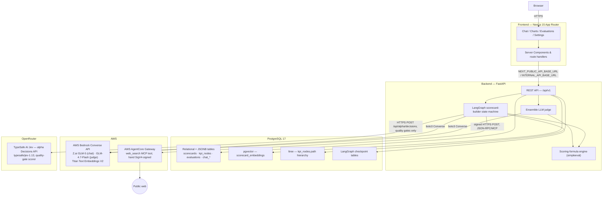
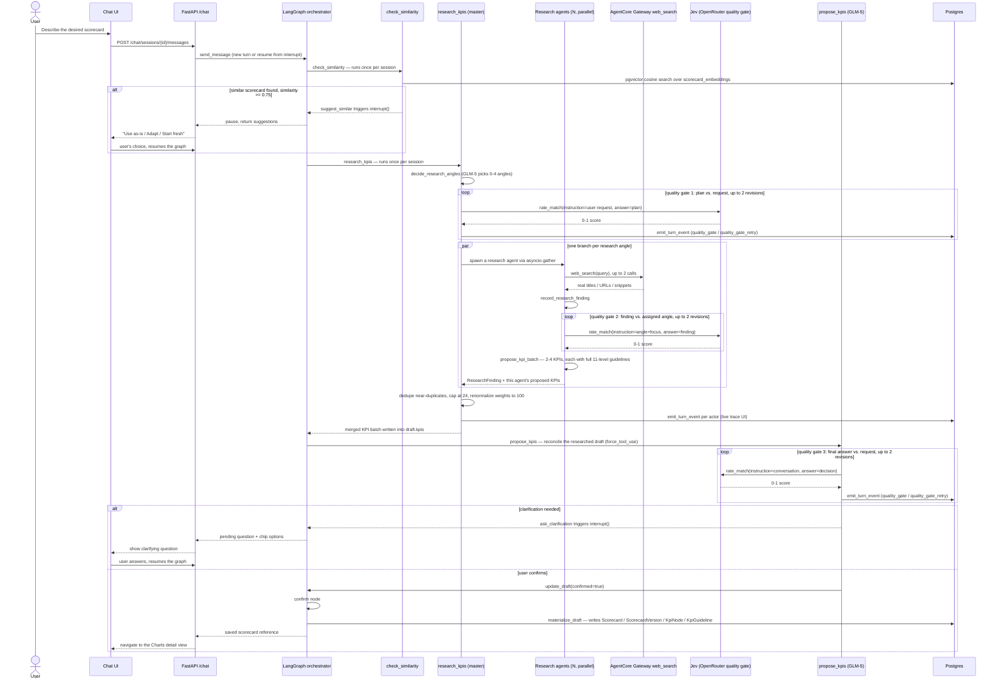
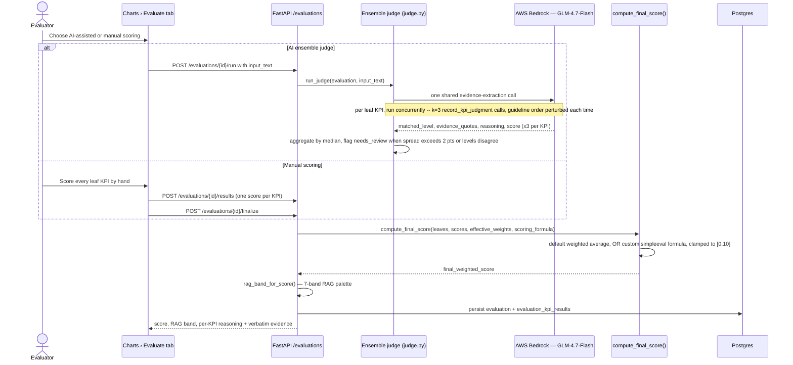

# ScoreSmith


**ScoreSmith** (working title: Quality Scorecard System) is a generic scorecard creation & rating system — think Google Forms, but for quality scorecards. Instead of hard-coding one fixed rubric for one fixed type of work, ScoreSmith lets a user *define* what quality means for any domain (a weighted, hierarchical set of KPIs with 11-level qualitative + quantitative guidelines) through a chat-driven, research-grounded builder, then apply that definition consistently and repeatably — by a human or an ensemble LLM judge — to rate real inputs and get a reasoned, evidence-cited, RAG-banded score. It is built directly against TalenciaGlobal's Quality Scorecard Framework and Data-Driven Development Framework (`References/`), and the current build is explicitly scoped to Phase 0 + Cycle 1 of that framework (see [Status & roadmap](#status--roadmap)).

## Key features

- **Chat-driven scorecard builder** — a [LangGraph](https://github.com/langchain-ai/langgraph) state machine, backed by AWS Bedrock (Z.ai GLM-5), asks clarifying questions, proposes KPIs "LLM first, human second," and checkpoints every step to Postgres so a session survives a server restart mid-question.
- **Genuine multi-agent research fan-out** — before the first KPI is ever proposed, the graph decides 0–4 distinct research angles for the user's domain, then runs that many independent research agents *concurrently* (`asyncio.gather`, not sequentially), each with its own real web-search budget via an AWS Bedrock AgentCore Gateway MCP tool. Each agent proposes its **own** small batch of fully-specified, grounded KPIs (name, weight, full 11-level guidelines) — the total KPI count grows with research breadth instead of being capped by one giant end-of-pipeline call.
- **Embedding-based reuse suggestions** — a new request is checked against existing scorecards (pgvector cosine similarity over Titan-embedded purpose text, threshold 0.75) and offered as "use as-is / adapt / start fresh" *before* generating from scratch.
- **Ensemble LLM judge** — every leaf KPI is scored by **3 independent** Bedrock Converse calls (Z.ai GLM-4.7-Flash) with the guideline rungs presented in a different order each time (ascending / descending / deterministic shuffle) to counter position bias, aggregated by median, and flagged `needs_review` when the calls disagree.
- **Reasoning-before-score judging** — the judge's tool schema forces `matched_level → evidence_quotes → reasoning → score`, so the model commits to a rubric level and cites verbatim evidence before it ever writes a number.
- **Custom scoring-formula engine** — the default weighted average can be overridden with an arbitrary safe expression (`kpi["Name"] * 0.6 + min(kpi["A"], kpi["B"]) * 0.4`, `+ - * / **`, `min/max/avg/mean/sqrt/abs`), parsed via `simpleeval`'s AST whitelist (no `eval`), used identically by both the AI judge and manual scoring paths so they can never disagree about what a score means.
- **Hierarchical KPI trees** — up to 4 levels deep, stored as Postgres `ltree` materialized paths, each leaf carrying a full 0–10 qualitative + quantitative guideline ladder.
- **Live agent-execution trace** — every research agent and the orchestrator itself streams granular events (`started`, `searching`, `search_result`, `proposing_kpis`, `completed`, `quality_gate`/`quality_gate_retry`, ...) to a dedicated table, rendered live in the chat UI instead of a generic spinner.
- **Quality-gate self-critique layer** — three checkpoints in the chat pipeline (the master's research-angle plan, each research agent's finding, and `propose_kpis`'s final per-turn answer) are rated 0–1 by [TypeSafe AI's **Jev**](https://openrouter.ai/docs/guides/community/jev) — a "System One" non-autoregressive decision model reached via OpenRouter's alpha Decisions API, **not** AWS Bedrock — against a 0.75 threshold. Below threshold, the relevant step revises itself (bounded at 2 retries, then proceeds with its best attempt); an unreachable Jev degrades the gate to "passed" rather than blocking the pipeline on a third-party dependency.
- **Manual and AI-driven evaluation**, converging on one shared scoring computation and 7-band RAG (Red/Amber/Green) result.
- **Glassmorphism design system** (white + lemon yellow `#FFF700`), with an explicit glass-vs-solid rule: glass surfaces for chrome/cards/modals, solid panels for dense data (guideline matrices, KPI/weight tables).

## Architecture

### System overview



### Chat-to-scorecard flow (the research fan-out in detail)



### Evaluation flow (manual and AI ensemble, one shared computation)



## Tech stack

| Layer | Technology |
|---|---|
| Backend framework | FastAPI 0.115, Python 3.12, Uvicorn |
| ORM / migrations | SQLAlchemy 2.0 (async), Alembic, `psycopg[binary]` v3 |
| Validation | Pydantic v2 / pydantic-settings |
| Agent orchestration | LangGraph 1.2 + `langgraph-checkpoint-postgres` (Postgres-backed checkpointing) |
| LLM access | boto3 → AWS Bedrock Converse/ConverseStream API |
| Chat / builder model | Z.ai GLM-5 (`zai.glm-5`) |
| Judge model | Z.ai GLM-4.7-Flash (`zai.glm-4.7-flash`) — cheap enough to justify a k=3 ensemble |
| Embeddings | Amazon Titan Text Embeddings V2 (`amazon.titan-embed-text-v2:0`) |
| Web search | AWS Bedrock AgentCore Gateway (MCP `tools/call`, hand-rolled SigV4 over `httpx`) |
| Quality gate (self-critique) | TypeSafe AI **Jev** via OpenRouter's alpha Decisions API (`typesafe/jev-1.13`) — a separate provider from Bedrock, used only for the three 0–1 quality-rating checkpoints |
| Safe formula evaluation | `simpleeval` (AST-whitelisted, no `eval`/`exec`) |
| Database | PostgreSQL 17 (`pgvector/pgvector:pg17`), `pgvector` + `ltree` extensions |
| Frontend framework | Next.js 15 (App Router), React 19, TypeScript 5.7 |
| Styling / UI | Tailwind CSS 4, shadcn/ui on Radix primitives, `lucide-react` |
| Data viz / tables | Recharts, TanStack Table |
| Local dev / infra | Docker Compose (3 services: `db`, `backend`, `frontend`) |
| Lint / test (backend) | `ruff`, `pytest` + `pytest-asyncio` (against a real Postgres — no mocks) |
| Lint / test (frontend) | ESLint, `tsc --noEmit` (no dedicated JS test runner is wired up yet) |

## Project structure

```
ScoreSmith/
├── backend/                  FastAPI + SQLAlchemy + LangGraph + boto3
│   ├── app/
│   │   ├── ai/                Bedrock client, Jev/OpenRouter quality-gate client, scorecard-builder graph, judge, scoring-formula engine, web search
│   │   ├── api/v1/             REST routers: users, scorecards, kpi_nodes, evaluations, chat
│   │   ├── models/             SQLAlchemy ORM models (scorecards, kpi_nodes, evaluations, chat_*, ...)
│   │   ├── schemas/            Pydantic request/response schemas
│   │   └── scripts/            seed.py (idempotent Cycle 1 scenario catalogue), generate_scenarios.py
│   ├── alembic/                Database migrations
│   └── tests/                  pytest suite — 113 tests, run against a real Postgres instance
├── frontend/                  Next.js 15 App Router + TypeScript
│   ├── app/                    /chat, /charts, /evaluations, /settings routes ("/" redirects to /chat)
│   ├── components/             chat/, chart-detail/, charts-library/, evaluation-result/, design-system/, layout/
│   └── lib/                    API client, hooks, shared utils
├── infra/                     docker-compose.yml, .env.example, db-init scripts
├── docs/                      Initial product scope, data dictionary, Cycle 2/3 plan, cloud deployment plan
└── References/                Source framework PDFs (RAG Quality Scorecard, Data-Driven Development)
```

## Getting started / local development

Requires Docker + Docker Compose, and AWS Bedrock access (a Bedrock "API key" bearer-token credential or a SigV4 IAM key pair) for the AI features — the rest of the app (scorecard CRUD, manual evaluation) works without Bedrock configured.

```bash
cd infra
cp .env.example .env
# Fill in at minimum: AWS_ACCESS_KEY_ID / AWS_SECRET_ACCESS_KEY (see the note below), AWS_REGION.
# Optionally fill in AGENTCORE_GATEWAY_* to enable real web search in the research fan-out —
# left blank, web_search.py just returns no results rather than failing the chat turn.
# Optionally fill in OPENROUTER_JEV_API to enable the Jev quality-gate self-critique layer —
# left blank, every gate check degrades to "passed" rather than blocking the chat turn.
docker compose up --build
```

- Frontend: <http://localhost:3000>
- Backend API: <http://localhost:8000> (interactive docs at `/docs`, health check at `/health`)
- Postgres: `localhost:5432`

Migrations and seed data are **not** run automatically on container start — run them once after the stack is up:

```bash
docker compose exec backend python -m alembic upgrade head
docker compose exec backend python -m app.scripts.seed
```

### Key environment variables (`infra/.env.example`)

| Variable | Purpose |
|---|---|
| `POSTGRES_USER` / `POSTGRES_PASSWORD` / `POSTGRES_DB` / `POSTGRES_PORT` | Local Postgres container |
| `TEST_DATABASE_URL` | Sibling test database, kept separate so `pytest`'s per-test `TRUNCATE` never touches seeded dev data |
| `BACKEND_PORT` / `FRONTEND_PORT` | Compose host port mappings |
| `AWS_REGION`, `AWS_ACCESS_KEY_ID`, `AWS_SECRET_ACCESS_KEY` | Bedrock credentials. **Note**: if your credential is a Bedrock long-term "API key" (bearer token) rather than a real SigV4 IAM pair, plain `AWS_ACCESS_KEY_ID`/`AWS_SECRET_ACCESS_KEY` fails with `UnrecognizedClientException`; `docker-compose.yml` auto-derives `AWS_BEARER_TOKEN_BEDROCK` from `AWS_SECRET_ACCESS_KEY` (prefixed `A`) to work around this — see the comments in `infra/docker-compose.yml` and `infra/.env.example` for the full story |
| `BEDROCK_CHAT_MODEL_ID` / `BEDROCK_JUDGE_MODEL_ID` / `BEDROCK_EMBEDDING_MODEL_ID` | Default to `zai.glm-5`, `zai.glm-4.7-flash`, `amazon.titan-embed-text-v2:0` |
| `AGENTCORE_GATEWAY_WEB_SEARCH_URL` / `_TOOL_NAME` / `_AWS_ACCESS_KEY_ID` / `_AWS_SECRET_ACCESS_KEY` | AWS AgentCore Gateway web-search tool — a separate credential pair from the main Bedrock ones; the only web-search backend this project talks to |
| `OPENROUTER_JEV_API` | OpenRouter API key for the Jev quality-gate layer (`app/ai/jev_client.py`) — a separate provider from Bedrock. Left blank, every gate check degrades to "passed" rather than blocking the chat turn |
| `NEXT_PUBLIC_API_BASE_URL` | Backend URL as seen by the *browser* (client-side fetches) |
| `INTERNAL_API_BASE_URL` | Backend URL as seen *inside* the frontend container (server components / route handlers), via the Compose service name |
| `JWT_SECRET` | Present in `.env.example` for future real auth; not currently read anywhere in the backend — see [Current limitations](#current-limitations) |

## Running tests

### Backend

Tests run against a **real** Postgres instance (no mocks for the DB layer) — a sibling `quality_scorecard_test` database, auto-derived by `tests/conftest.py` from `DATABASE_URL` unless `TEST_DATABASE_URL` is set explicitly.

```bash
cd backend
uv venv --python 3.12 .venv && uv pip install --python .venv -e ".[dev]"   # or: python3.12 -m venv .venv && .venv/bin/pip install -e ".[dev]"
# one-time: create the test DB with the vector + ltree extensions (already done by
# infra/db-init/02-create-test-db.sql on a fresh docker-compose volume)
.venv/bin/python -m pytest        # 113 tests as of this writing
.venv/bin/python -m ruff check .  # lint
```

(Windows note: `psycopg`'s async mode needs the selector event loop, which `app/main.py` and `tests/conftest.py` already set automatically on `sys.platform == "win32"`.)

### Frontend

There is no dedicated JavaScript test runner wired up yet — the quality gates are the TypeScript compiler, ESLint, and a production build:

```bash
cd frontend
npx tsc --noEmit
npm run lint
npm run build
```

## Status & roadmap

This build corresponds to **Phase 0 + Cycle 1** ("Data Foundation") of the Data-Driven Development Framework (`References/Data_Driven_Development_Framework_v1.1.pdf`): schema + data dictionary (`docs/data_dictionary.md`), an idempotent scenario catalogue (`backend/app/scripts/generate_scenarios.py`), and a working first build — the chat scorecard builder, the ensemble LLM judge, and the Charts/Evaluations UI.

**Explicitly deferred**, and scoped concretely in `docs/cycle_2_3_plan.md`:
- **Cycle 2 (Test & Migration)** — deliberately-flawed/migration data hardening: concurrent-edit races on KPI weights, partial-failure materialization, embedding-model drift at volume, real messy spreadsheet import, referential races on delete-during-evaluation.
- **Cycle 3 (Business Behaviour, Specification & Testing)** — the scorecard `draft → published → archived` lifecycle is defined in the schema but not enforced by any endpoint; the framework's QTC (Quality/Time/Cost) gate is not modeled (only Quality is computed today); Red-diagnosis and Aptitude/Capability/Competency tracking are not implemented at all; a `needs_review`-flagged KPI result has no attached human review workflow yet.

See `docs/cloud_deployment_plan.md` for the (also planning-only) path from today's local Docker Compose stack to a real AWS deployment (Aurora PostgreSQL, Secrets Manager, App Runner, CI/CD).

## Current limitations

Documented honestly rather than glossed over:

- **Auth is a dev-only stub.** `app/deps.py::get_current_user` trusts a raw `X-User-Id` header or an unsigned `Authorization: Bearer <user-id>` token — there is no signature verification, no token expiry, and no password/identity check of any kind. Real OIDC/OAuth2 auth is explicitly deferred.
- **No RBAC / multi-tenancy yet.** `users.org_id` and `users.role` exist as plain scalar columns with no enforcement; a `role` string is a documented convention, not a DB-enforced permission.
- **The weight-sum-to-100 rule is DB-enforced but only at commit time** (a deferred trigger), which is why sibling KPI groups must be created via the bulk endpoints rather than one node at a time — see `backend/app/api/v1/kpi_nodes.py`'s module docstring.
- **No automated regression coverage for the Cycle 2 failure scenarios yet** (concurrent edits, partial materialization failure, etc.) — they're scoped, not built.
- **The frontend has no dedicated test framework** — `tsc`, ESLint, and a production build are the current gates.
