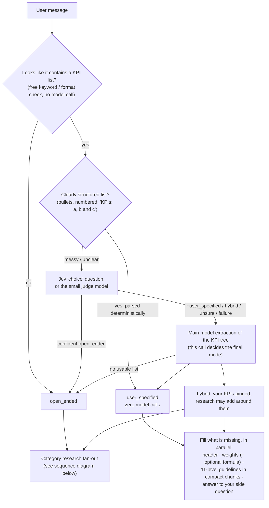
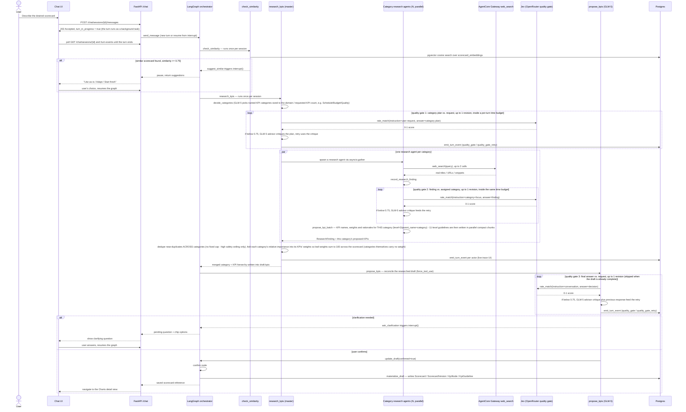
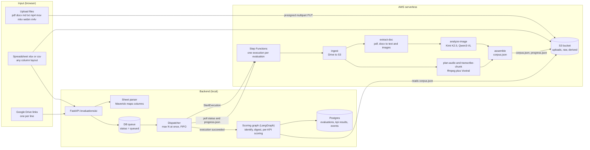
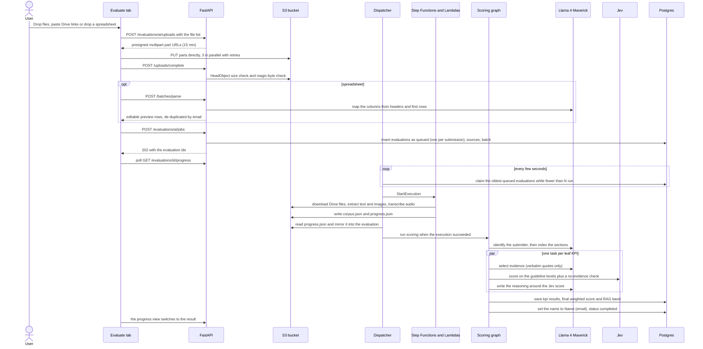
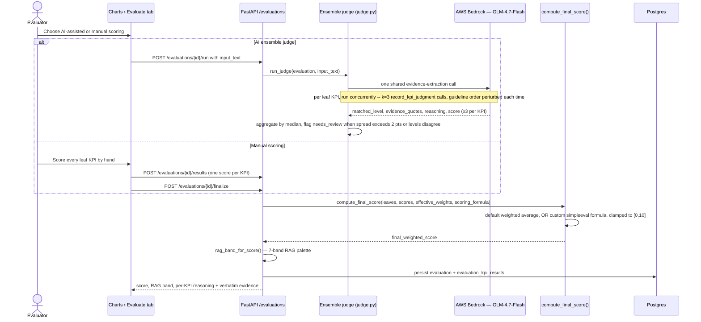

# AI features in depth

The chat scorecard builder, the ensemble judge and the AI evaluation pipeline for real submissions, with their flows,
limits and measured performance. This page is the detailed companion of the [root README](../README.md); the
system-level picture (processes, auth, sharing, data model) is in [architecture.md](architecture.md), and every
environment variable is in [configuration.md](configuration.md).

> Process model note: chat turns and evaluations are *queued in Postgres* and run by `worker` processes (`ROLE=worker`),
> not by the HTTP API (`ROLE=api`). Wherever this page says "the dispatcher" or "a background task", read "a worker
> that holds a lease on the row". With `ROLE=all` (tests, `uvicorn` on a laptop) the same code runs inside one process.

## Key features

- **Chat-driven scorecard builder** — a [LangGraph](https://github.com/langchain-ai/langgraph) state machine, backed by AWS Bedrock (Z.ai GLM-5), asks clarifying questions, proposes KPIs "LLM first, human second," and checkpoints every step to Postgres so a session survives a server restart mid-question.
- **Two ways to start a scorecard, chosen automatically** — if you describe a use case ("a quality scorecard for SRE incident response") the builder designs the KPIs for you (*open-ended mode*). If you paste your own KPI list with the use case, it **keeps your KPIs exactly as written** and only fills in what is missing (*user-specified mode*). A list plus "and suggest more" runs both (*hybrid mode*). See [How the chat decides what to do](#how-the-chat-decides-what-to-do).
- **Your KPIs are protected** — in user-specified and hybrid mode the builder never drops, renames, re-parents, dedupes or caps your KPIs, and never silently changes a weight or guideline *you* supplied. A later change is accepted only when your latest message actually asks for it (checked server-side, not left to the model). Weights you didn't give are filled in (research-informed risk/impact weighting, optionally with a suggested scoring formula); weights you gave are kept, and only rescaled — with a note — if they don't sum to 100.
- **Genuine multi-agent, CATEGORY-based research fan-out (open-ended mode)** — before the first KPI is ever proposed, the graph decides named, business-recognizable KPI categories for the user's domain (e.g. "Schedule", "Budget", "Quality" for a project-milestone scorecard), then runs one independent research agent per category *concurrently* (`asyncio.gather`, not sequentially), each with its own real web-search budget via an AWS Bedrock AgentCore Gateway MCP tool. Each agent proposes its **own** batch of grounded KPIs nested under its category; their 11-level guidelines are then written in parallel, compact chunks. A cross-category dedup/merge pass resolves near-duplicate KPI concepts (obvious duplicates deterministically, borderline pairs by one batched judge call) before the result is shown, grouped by category, both on screen and in the saved `kpi_nodes` hierarchy.
- **Dynamic KPI count, no fixed ceiling** — the number of KPIs follows the use case. Ask for "35 KPIs" (or "30-40", "forty") and the result lands within ±2 of that; if the task honestly doesn't support that many distinct, good KPIs it returns fewer and tells you why instead of padding. Only high safety limits apply (300 KPIs total, 60 per category, 24 categories).
- **Follow-up edits are one small operation** — "make Customer Satisfaction Score 8% and scale the others" is applied by the server (`edit_kpis`: set weight with proportional rebalance, rename, remove, add, move, regenerate one KPI's guidelines), so the model never has to re-type the whole scorecard. The reply is a server-built summary of what really changed.
- **Chat turns run in the background** — sending a message returns immediately (`202`); the UI polls the session and a live trace, so the draft header, your KPIs, weights and guidelines appear on screen as they are ready, with no refresh, an elapsed timer and a Cancel button. A refresh mid-turn resumes where it was.
- **Cheap request routing** — a free keyword/format check, then Jev's multiple-choice `choice` question (or the small judge model) decides the mode; only a confident "open-ended" skips the full extraction, and a clearly structured list is parsed with zero model calls.
- **Embedding-based reuse suggestions** — a new request is checked against existing scorecards (pgvector cosine similarity over Titan-embedded purpose text, threshold 0.75) and offered as "use as-is / adapt / start fresh" *before* generating from scratch.
- **AI evaluation of real submissions** — upload videos / PDFs / DOCX, paste public Google Drive links, or drop a spreadsheet of submissions in *any* column layout. Downloading, text/image extraction, transcription and image OCR run on **AWS serverless** (S3 + Step Functions + Lambda), not on your machine. Locally, a LangGraph pipeline has **Llama 4 Maverick** (the master agent) pick the relevant evidence for each KPI, **Jev** score it against that KPI's guideline ladder, and Maverick write the reasoning. See [AI evaluation of real submissions](#ai-evaluation-of-real-submissions-files-google-drive-spreadsheets).
- **Batch evaluation with a queue** — a spreadsheet becomes one evaluation per row. A DB-backed dispatcher runs a bounded number at once (default 3, up to 5), starts the next as soon as one finishes, adapts to AWS/Bedrock throttling instead of failing, and survives a backend restart. The AI names each evaluation `Name (email)` from the sheet or the submission.
- **Ensemble LLM judge (text-only path)** — every leaf KPI is scored by **3 independent** Bedrock Converse calls (Z.ai GLM-4.7-Flash) with the guideline rungs presented in a different order each time (ascending / descending / deterministic shuffle) to counter position bias, aggregated by median, and flagged `needs_review` when the calls disagree.
- **Reasoning-before-score judging** — the judge's tool schema forces `matched_level → evidence_quotes → reasoning → score`, so the model commits to a rubric level and cites verbatim evidence before it ever writes a number.
- **Custom scoring-formula engine** — the default weighted average can be overridden with an arbitrary safe expression (`kpi["Name"] * 0.6 + min(kpi["A"], kpi["B"]) * 0.4`, `+ - * / **`, `min/max/avg/mean/sqrt/abs`), parsed via `simpleeval`'s AST whitelist (no `eval`), used identically by both the AI judge and manual scoring paths so they can never disagree about what a score means.
- **Hierarchical KPI trees** — up to 4 levels deep, with weights on leaf KPIs only (categories/sections are unweighted groupings), stored as Postgres `ltree` materialized paths, each leaf carrying a full 0–10 qualitative + quantitative guideline ladder.
- **Live agent-execution trace** — every research agent and the orchestrator itself streams granular events (`started`, `searching`, `search_result`, `proposing_kpis`, `completed`, `quality_gate`/`quality_gate_retry`, ...) to a dedicated table, rendered live in the chat UI instead of a generic spinner.
- **Quality-gate self-critique layer (open-ended mode)** — three checkpoints in the chat pipeline (the master's KPI-category plan, each category research agent's finding, and `propose_kpis`'s final per-turn answer) are rated 0–1 by [TypeSafe AI's **Jev**](https://openrouter.ai/docs/guides/community/jev) — a "System One" non-autoregressive decision model reached via OpenRouter's alpha Decisions API, **not** AWS Bedrock — against a 0.75 threshold. Below threshold, a GLM-5 **advisor/critique** step first reads the task, the actual output and the Jev score and names the specific problems and a concrete fix; the step then retries once with that critique. The gate is bounded three ways: one revision, a 12 s timeout per Jev call, and a per-turn time budget (150 s) after which no further gate work starts — then the pipeline proceeds with its best attempt. It is skipped where it can't add value (your own KPIs, an already-complete draft, simple edits). An unreachable Jev degrades the gate to "passed" rather than blocking the pipeline on a third-party dependency.
- **Manual and AI-driven evaluation**, converging on one shared scoring computation and 7-band RAG (Red/Amber/Green) result. Evaluations show live progress (queue position, per-file state, stage, event log) and can be cancelled or retried.
- **Yellow/gold glassmorphism design system** (warm off-white + amber `#FFC21A`), with an explicit glass-vs-solid rule: glass surfaces for chrome/cards/modals, solid panels for dense data (guideline matrices, KPI/weight tables). See [frontend/README.md](../frontend/README.md#design-system).

## Flows

The system-level architecture diagram lives in [architecture.md](architecture.md#1-system-architecture). The sections below zoom into the AI flows.

### How the chat decides what to do

On a session's first message (and on any later message that pastes a new KPI list) the builder first works out *what you gave it*, cheaply, before spending model time:



Every failure path falls back to `open_ended`, and a router answer other than a *confident* `open_ended` is never trusted on its own — it can only remove work, never replace the full extraction. `REQUEST_ROUTER=off` disables the router entirely.

**What "fill what is missing" means in user-specified mode**

| Piece | How it is produced |
|---|---|
| Name, purpose, domain, audience, target score | One small bounded call right after mode detection (deterministic fallback from your message if it fails), so the live preview shows them within seconds. Anything you stated yourself is never overwritten. |
| Weights | Yours are kept (rescaled proportionally, with a note, only if they don't sum to 100). Missing ones come from a single weighting step: risk/impact-based relative importance, grounded in a scoped web search when search is configured, otherwise equal shares. |
| Scoring formula | Suggested (e.g. `min`-based gating for compliance KPIs) only when your use case implies it, you gave no formula, and it validates and references every scored KPI. |
| 11-level guidelines | Written by concurrent agents in small compact chunks (see below), using scoped benchmark research per group of KPIs; a time budget drops research and falls back to model-knowledge rubrics rather than stalling. |
| Answer to your side question | Questions in your message ("…and why is this scorecard needed?") are answered by a dedicated bounded call that runs alongside the work, then shown before the closing question. |

**The first-turn reply is written by the server, not the model.** Once your KPIs, weights, guidelines and header are all in place, no further model step is needed: the server composes the reply itself — the answer to your side question, then a compact summary (KPI count, scorecard name and target, the five highest and three lowest weights with their real percentages, a note if any KPI only got a fallback rubric; capped at ~1,200 characters, never a per-KPI dump) — and pauses with a single "save as-is or adjust?" question card with option chips. A model step is kept only when something is missing or a scoring-formula hint is still unapplied. The same cap applies to follow-up edit summaries and to the server-forced pause. **One-question contract:** when a turn returns a question card, the saved message text never also contains a question, so the question appears exactly once (on reload too); turns with no card (conversational answers, edit summaries) carry exactly one closing question in their text.

**Compact rubrics.** Generation time is dominated by output tokens, so a KPI's rubric is requested in a terse shape — `metric`, `unit`, `direction`, 11 short level texts (≤ 20 words) and 11 numeric thresholds — and the full guideline object (with `quantitative_criteria = {metric, operator, value, unit}`) is rebuilt in code. A KPI is only accepted with exactly 11 distinct, non-empty levels; thresholds that are non-numeric or out of order are dropped (the text is kept); anything incomplete is re-requested in smaller chunks (full chunk → halves → single KPI → a clearly marked fallback rubric as a last resort). A draft with any leaf below 11 levels can never be confirmed or saved. Every KPI is asked for a measurable proxy metric (a rate, count, time, or reviewer score) — a KPI that still ends up with no numbers keeps its text with a "[proposed target — please validate]" marker rather than invented values.

### Chat-to-scorecard flow (the research fan-out in detail)

This is the **open-ended** path (and the research half of hybrid). The turn itself runs as a background task: the API answers `202` immediately and the UI follows progress by polling (see [Chat turns in the background](#chat-turns-in-the-background)).



### Chat turns in the background

A turn can take from seconds (a follow-up edit) to a few minutes (research plus guidelines for dozens of KPIs), so it never holds an HTTP request open.

| Endpoint | Behaviour |
|---|---|
| `POST /api/v1/chat/sessions` | Creates the session, saves your first message, starts the turn as a background task, returns **202** with `turn_in_progress: true`. |
| `POST /api/v1/chat/sessions/{id}/messages` | Same for a follow-up. **409** if a turn is already running on that session. |
| `GET /api/v1/chat/sessions/{id}` | Current state: `status`, `draft`, pending `question` (chips), `assistant_message`, `turn_in_progress`, `turn_error`, `turn_error_code` (`bedrock_unavailable`, `timeout`, `interrupted`, `cancelled`, `turn_failed`). **While a turn runs this returns an interim draft** — the scorecard header and your KPIs within seconds, weights and guidelines as each chunk finishes. |
| `GET /api/v1/chat/sessions/{id}/turn-events` | The live agent trace (`classifying`, `mode_detected`, `weighting`, `guidelines` "Wrote guidelines for 12/35", `timing` per phase, research-agent events, quality gates, errors). |
| `POST /api/v1/chat/sessions/{id}/cancel` | Stops the running turn (the session is kept; `turn_error_code = "cancelled"`). |
| `DELETE /api/v1/chat/sessions/{id}` | Cancels a running turn, then deletes the session. |

- **The frontend polls** (every ~1.2 s while a turn runs, slower in a hidden tab, exponential backoff with jitter on errors, one sequential watcher per open chat, aborted on unmount). Polling was chosen over SSE/WebSockets because all state is durable in Postgres — a refresh, a second tab or a backend restart simply resumes polling — and `EventSource` cannot send the CSRF header / custom headers the cookie-authenticated API expects.
- **Safety nets:** a turn is capped at `CHAT_TURN_TIMEOUT_SECONDS` (default 900 s); a turn is a *leased* row (`chat_sessions.turn_lease_*`): its worker renews the lease every `LEASE_HEARTBEAT_SECONDS`, and a turn whose lease expired (worker crashed) is marked `interrupted` by the reaper in any live worker, so the UI offers a retry. A SIGTERM drain gives running turns `WORKER_DRAIN_GRACE_SECONDS` to finish, then records `interrupted`. Lifecycle diagram: [architecture.md](architecture.md#3-chat-turn-lifecycle).
- **Tests / scripts:** `?wait=true` (or `CHAT_TURNS_INLINE=true`) runs a turn inline and returns the final result, which is what the older API tests use.

### AI evaluation of real submissions (files, Google Drive, spreadsheets)

The **Evaluate → Ask the AI judge** tab scores real hackathon-style submissions — videos, PDFs, Word documents and Markdown/text write-ups — against a scorecard. A submission comes from uploaded files, a public Google Drive link (folder, file, or a Docs/Sheets/Slides link), or a spreadsheet of many Drive links (one evaluation per row). An optional "guidance" prompt can steer what the judge emphasises (it never overrides the guidelines). There is no evaluation name to type: the AI names each evaluation `Name (email)` from the sheet row, or from the submission itself, falling back to the main file's name.

The heavy work (downloading, PDF/DOCX extraction, ffmpeg, transcription, image OCR) runs on **AWS serverless**, never on the local machine. Only the scoring pipeline runs locally in the backend (`backend/app/pipeline/`), reading the extracted text back from S3.





**How a submission is turned into a score**

| Stage | What happens |
|---|---|
| Ingest (Lambda) | Drive links are validated against an allowlist (`drive.google.com`, `docs.google.com`, `drive.usercontent.google.com`, https only, public IPs only, every redirect re-checked), then the files are streamed into S3. Folders are listed with `gdown` (Google caps a folder listing at 50 files), single files are streamed with a size cap. The file type comes from the extension **or, when there is none, from the content** (PDF `%PDF`, DOCX zip with `word/document.xml`, video by ffmpeg probe). |
| Extract (Lambda) | PDFs and DOCX are turned into text in reading order plus images, vector figures and tables (PyMuPDF / python-docx, ported from `scripts/extract_assets.py`). Markdown and text files are split into page-sized sections. Each image is read by a vision model (Kimi K2.5, then Qwen3-VL, then Maverick as fallbacks — `scripts/analyze_images.py`). |
| Transcribe (Lambda) | The audio track is cut into ~5-minute chunks at pauses and each chunk is transcribed with Mistral Voxtral through the Bedrock Converse API, in parallel (`scripts/transcribe_videos.py`). No Amazon Transcribe job is needed. |
| Assemble (Lambda) | Everything is stitched into `derived/{evaluation}/corpus.json`: one section per PDF page, per transcript chunk and per image analysis, with warnings for anything skipped. |
| Identify | Llama 4 Maverick reads the file names and cover text and returns the submitter's name and email — only if they literally appear in the text; otherwise the sheet row, then a regex, then the main file's name. |
| Evidence | For every leaf KPI Maverick (the "master agent") picks the relevant passages from a section index. Every quote must be a verbatim substring of the corpus or it is dropped. The corpus is wrapped as untrusted data, so instructions hidden inside a submission are ignored. |
| Score | **Jev** places that evidence on the KPI's guideline ladder. Jev's `score` question accepts at most 10 levels, so levels 1–10 are the criteria (score = position + 1, fractional) and a `noul` "is there any relevant evidence?" question in the same call decides level 0 (below 0.10 gives a score of 0). If Jev is unreachable the KPI falls back to one Maverick/GLM judgment and is flagged `needs_review`. |
| Reasoning | Maverick writes the explanation around Jev's verdict, citing the evidence. |
| Aggregate | The same `compute_final_score()` as manual scoring (default weighted average or the custom formula), the RAG band, and one `evaluation_kpi_results` row per leaf (with `jev_raw` holding Jev's position, probabilities and confidence). |

**Scoring accuracy: what is done about the known weak spots.** Two independent audits of real evaluations (25 KPIs each, checked against the original PDFs) found the scores mostly within one level of an expert reading, with the errors concentrated in a few patterns. Each has a specific safeguard:

| Weak spot found | Safeguard |
|---|---|
| The master model quotes the wrong table or page and misses the real evidence, so a KPI scores too low (test coverage scored 0 while a table reported 91–100 %) | The first pass reads the model's chosen sections **plus the sections a keyword (BM25) ranking finds for the KPI**. Any KPI scoring **3.5 or below** then gets a **second look**: the best keyword-matched sections are re-read in full looking for any supporting passage, the KPI is re-scored with the combined evidence, and the re-score replaces the first only if it is at least 0.3 higher (`jev_raw.second_look` records both scores). |
| Credit for unfilled template text (a declaration KPI rose from 1 to 4 on "[Add tools used…]") | Placeholders (`[Add …]`, `TODO`, `TBD`, `<insert …>`, lorem ipsum) are dropped from every evidence set. |
| Credit for what a video shows when the video could not be analysed (a template table scored 8.1; "exceeds 5 min" claimed for a 1:21 video) | The pipeline now knows each video's length and whether it is silent or transcribed (from the extraction step's `plan.json`) and passes that to the evidence, scoring and reasoning prompts, with an instruction never to credit unverified claims about video content. A KPI about what a video shows or says, with a video that could not be analysed, is **flagged `needs_review`** (`jev_raw.video_unverifiable`). |
| The same document scoring differently on every run (mean 0.6 points per KPI, some 3–4 points apart) | The master model runs at **temperature 0**. Re-scoring the same submission twice now differs by a mean of about 0.25 per KPI (more than a point on 6 of 97 KPIs instead of 21), and the overall score came out identical. |
| Throttling or unusable quotes silently degrading a KPI | Quotes that are not verbatim get one corrective retry, and a KPI whose model calls stay throttled waits and retries before any fallback (a fallback is always flagged `needs_review`). |

Measured on the two audited submissions: G.S.Jithesh 3.45 → 3.89 (the auditor's estimate of the true score was 3.8–4.3) and Andrea Mercy 3.05 → 3.40 (estimate 3.2–3.8). Judgement errors that are not retrieval problems remain (counting items, reading a screenshot count, picking between adjacent guideline levels), so treat scores as a strong first read and review the KPIs flagged `needs_review`.

**Evaluation status.** There is no separate `cancelled` status: a cancelled evaluation is `failed` with `error_code = cancelled` (and `cancel_reason = cancelled_by_trash` when its chart was moved to the trash).

| Status | Meaning |
|---|---|
| `queued` | Saved, waiting for a free slot. The progress view shows the queue position. |
| `ingesting` | On AWS: fetching, extracting, transcribing, analysing images (`stage` = `ingest` / `extract` / `transcribe` / `analyze` / `assemble`). |
| `scoring` | Local graph (`stage` = `scoring:identify`, `scoring:digest`, `scoring:kpi 12/35`, …). |
| `completed` / `failed` | Done. A failure carries an `error_code` (`drive_invalid`, `drive_inaccessible`, `drive_quota`, `drive_empty`, `file_too_large`, `unsupported_type`, `extract_failed`, `no_content`, `timeout`, `cancelled`, `scoring_failed`, `internal`) and a human-readable message. **Retry** re-queues it and **Cancel** stops the AWS execution. |

**Batches and the queue.** A spreadsheet (or several Drive links) creates one evaluation per submission under one batch. The dispatcher (it runs in the `worker` processes; `ROLE=api` only enqueues) keeps at most `AI_EVAL_MAX_CONCURRENT` evaluations running (default 3, allowed 1–5), claims queued rows with `SELECT … FOR UPDATE SKIP LOCKED` whenever a slot frees up (oldest first, with per-user round robin so one user's big batch cannot starve others), and resumes in-flight executions by their `executionArn` after a restart. One failing submission never affects the others.

**Spreadsheets in any layout.** Maverick maps the columns from the header names and the first rows, so `Email Address / Name / Google Drive URL`, `College Mail / Student Name / Submission Link (Drive)` or `First Name / Last Name / E-mail / Project Folder` all work (a deterministic header-substring fallback is used if Bedrock is down). Title rows above the header are skipped, hyperlink cells and plain-text links are both read, first and last name columns are joined, a later submission by the same email replaces an earlier one, and rows with a missing email, a non-Drive host or "N/A" are flagged in an editable preview before anything is queued.

**Running at the speed the limits allow.** Several layers each have a limit, and the pipeline adapts instead of failing:

| Layer | Limit | Behaviour when it is hit |
|---|---|---|
| Dispatcher | `AI_EVAL_MAX_CONCURRENT` (1–5) | Extra evaluations wait in `queued` and start in order. |
| Step Functions | Per execution: 2 files at once, and within each file 3 images or 3 audio chunks at once (the maps are nested, so one evaluation can have up to about 6 Lambdas running) | Keeps one evaluation from taking every Lambda slot. |
| Lambda account quota | New accounts get **10** concurrent executions | Throttled invocations are retried patiently (up to 25 jittered attempts, capped at 30 s) rather than failing. Request a higher quota to go faster. |
| Bedrock (Maverick) | The account's tokens-per-minute and requests-per-minute quotas | An adaptive (AIMD) limiter, up to `BEDROCK_MAX_CONCURRENCY` (default 8) per process (or `BEDROCK_GLOBAL_CONCURRENCY` across all containers when `REDIS_URL` is set; it fails open to the per-process limit if Redis is down), halves its allowance when Bedrock throttles and grows back after sustained successes, and each call backs off with jitter. |
| Jev | 6 calls at once per evaluation (so up to 6 × `AI_EVAL_MAX_CONCURRENT` overall; optionally capped cluster-wide by `JEV_GLOBAL_CONCURRENCY` through Redis) | Failed or throttled calls are retried, then the KPI falls back to one model judgment and is flagged `needs_review`. |

The limits are separate caps, not one global number: the worst case is their product (3 evaluations × ~6 Lambdas can exceed the 10-Lambda account quota, and the excess is throttled and retried rather than failing). The Lambdas call Bedrock directly for transcription and image OCR, and are bounded only by the Step Functions maps and the Lambda quota.

To raise the Lambda quota (a one-off that you run yourself):

```bash
aws --profile arpan-aws --region us-east-1 service-quotas request-service-quota-increase \
    --service-code lambda --quota-code L-B99A9384 --desired-value 1000
```

**Security.** Uploads go straight from the browser to S3 with short-lived presigned multipart URLs. The bucket is private (Block Public Access, owner-enforced, SSE-S3, TLS-only) with CORS limited to the app's origin, and object keys are server-generated, never user file names. The backend's AWS user can only read and write its own S3 prefixes and start, describe and stop the one state machine. The Lambda role can only touch the bucket prefixes and invoke the specific Bedrock models. Uploaded PDFs and DOCX are only ever parsed inside Lambda, never on the backend. Raw files expire after 14 days and extracted text after 90 (S3 lifecycle rules), and a monthly budget alarm is created with the stack. Details and costs are in [`aws/README.md`](../aws/README.md), and the shared API and S3 contract is [`ai-eval-contract.md`](ai-eval-contract.md).

**Setting up AWS** (idempotent, needs the AWS CLI and Docker):

```bash
aws/bootstrap.sh --dry-run          # or: aws/bootstrap.ps1 -WhatIf   (prints the plan, changes nothing)
aws/bootstrap.sh                    # creates the bucket, ECR image, 6 Lambdas, state machine, roles, backend user
aws/deploy-lambdas.sh               # after changing Lambda code: rebuild the image and update the functions
aws/teardown.sh                     # removes everything (asks you to type the bucket name)
```

`bootstrap` writes `S3_BUCKET`, `SFN_STATE_MACHINE_ARN` and the backend user's access key into the git-ignored `infra/.env` (never printed). Without them the rest of the app works, and only the AI judge's file and Drive flow is unavailable.

### Manual evaluation and the text-only ensemble judge (one shared computation)



## Observed performance

Measured on one development machine against live Bedrock (GLM-5 for chat), AgentCore web search and Jev, using `scripts/e2e_chat_check.py`. Treat these as indicative, not guarantees — model latency varies a lot from run to run.

| Scenario | Before the latest optimisations | Now |
|---|---|---|
| 35 user-supplied KPIs, first turn (all 11 levels, weights, header, side-question answer) | ~10 min; an earlier build timed out at 25 min | ~37–53 s in the latest runs (earlier optimisation stages: 88–353 s, mostly one unpredictable model step that is now deterministic); mode detection takes 0 s via the deterministic parser |
| Normal prompt, web research on (SRE incident response, B2B sales calls) | ~17 min, 28–33 KPIs | ~90–100 s, 27–32 KPIs, 100 % of KPIs with numeric criteria in the latest runs (3.5 min in the previous build) |
| Follow-up edit ("make X 8 % and scale the others") | 5–10 min and could fail | ~20–45 s |

**AI evaluation of submissions** (real Google Drive folders and uploaded files from the sample hackathon sheet, a 35-KPI scorecard, default queue of 3, a new AWS account with 10 concurrent Lambdas and default Bedrock quotas):

| Scenario | Result |
|---|---|
| One submission (PDF + ~4 min video + 17 images), Drive link, end to end | 40–60 s |
| 5 uploaded submissions (mixed video/PDF/DOCX, `.mov`, `.webm`, DOCX-only, two PDFs), 3 at a time | ~5 min total |
| 3 rows of the real sample spreadsheet | 150 s |
| **20-row spreadsheet (reshuffled columns, fake names/emails, real links)** | **19 min total**, 18 completed and 2 failed (one folder held only a Markdown write-up, which was not yet a supported type at the time and is scored now; the other held only a file with a GitHub link, which fails with `no_content`), 36–284 s per evaluation (mean 183 s) |
| KPI results flagged `needs_review` in that batch | 21 of 630 (3.3 %) |

Scoring is the slow part of a batch: it is bounded by Bedrock's tokens-per-minute quota for Maverick, which the pipeline absorbs with backoff rather than failing. A higher quota (and a higher `AI_EVAL_MAX_CONCURRENT`) shortens batches roughly in proportion.

What moved the numbers: compact rubrics (≈4× fewer output tokens per KPI), small concurrent guideline chunks with a proper read timeout and connection pool, deterministic parsing of a clearly formatted KPI list, skipping the quality gate where it can't help and bounding it elsewhere, and server-side edit operations instead of re-typing the scorecard. Run-to-run variance is mostly GLM-5 output speed and Bedrock latency, so expect some spread; a first turn that has to fall back to a model step (something missing, or a formula hint) is slower than the deterministic path.

## Limits of the chat builder and the evaluation pipeline

**Chat-builder limits to be aware of**

- **Several workers are supported** (turns are claimed with `SELECT ... FOR UPDATE SKIP LOCKED` and kept alive by leases; only turns whose lease expired are recovered). The mid-turn interim draft is process-local, so after a worker dies only the last LangGraph checkpoint survives.
- **Research runs once per session.** A KPI count requested after the first turn, or a brand-new domain, is not re-expanded by the research fan-out (the model can still edit the draft).
- **Pinned-KPI change verification is deterministic and name-based.** A change is accepted when your latest message names the KPI and contains a change word (or confirms the assistant's immediately preceding proposal). Vague messages ("drop the second one") are bounced and the model asks you to confirm; a message that names a KPI next to an unrelated change word could verify an unintended change.
- **Mid-conversation KPI lists are detected heuristically.** A pasted list is recognised by bullets, numbering, a `KPIs:` cue, or four-plus short lines; a list written as plain prose may be missed.
- **Adding a KPI by chat has no deterministic fallback** (it needs a rubric), unlike set-weight / rename / remove.
- **Rubric quality at ≤ 20 words per level is not independently scored**, and thresholds for qualitative KPIs are judgement calls (they carry a "[proposed target — please validate]" marker when no real numbers could be produced). Read a few generated rubrics before relying on them.
- **Model/provider behaviour not measured offline:** Jev `choice` calibration, GLM-4.7-Flash tool-call adherence, and the real `has_more` / requested-count behaviour of GLM-5 — the ±2 count guarantee and the router were exercised against scripted models plus a handful of live runs. Cancelling a turn stops new calls from being scheduled; Bedrock calls already in flight finish on their own.
- **The text-only judge's `evidence_quotes` are required to be verbatim in its prompt, but nothing verifies them against the input text.** (The file/Drive pipeline *does* verify every quote against the extracted corpus.)

**AI evaluation pipeline limits**

- **Public links only.** Drive folders and files must be shared as "Anyone with the link". Otherwise the evaluation fails with `drive_inaccessible` and suggests uploading the files. Google can also throttle repeated downloads of the same file (`drive_quota`), and lists at most 50 files per folder; subfolders are ignored.
- **Supported inputs:** PDF, DOCX, Markdown/plain text (`.md`, `.txt`) and common video formats (mp4, mov, mkv, webm, m4v). Files with no extension are identified by their content. Archives (zip/rar), legacy `.doc`, slides and images are skipped with a warning, and Google Docs/Sheets/Slides links are exported. A submission with fewer than 30 extractable words (for example a file that only holds a GitHub link) fails with `no_content` instead of being scored. A video with no audio track (a silent screen recording) is marked `skipped` and the evaluation continues from the other files; the pipeline does not read what is shown on screen.
- **Throughput depends on AWS quotas.** A new AWS account allows 10 concurrent Lambda executions and modest Bedrock quotas, so large batches queue and retry rather than run flat out. The pipeline backs off automatically, and a quota increase is the way to go faster.
- **The scorecard decides what is measurable.** A submission is judged only against the KPIs it is run against; evidence that does not exist for a KPI scores low or zero by design (a customer-support scorecard run on a fleet-safety hackathon entry scores poorly).
- **Jev is an alpha API** (32k-token context, at most 10 score levels, no published rate limits); a KPI Jev cannot score falls back to one model judgment and is flagged `needs_review`.
- **Several dispatchers are supported.** Each evaluation is driven by the worker that holds its lease; when that worker dies or drains, another one adopts the row and resumes the Step Functions execution by ARN (scoring is idempotent). The global cap `AI_EVAL_MAX_CONCURRENT` is enforced in Postgres across all workers, and each user may have only one running evaluation job (see [architecture.md](architecture.md#2-evaluation-pipeline-and-lease-lifecycle)).
- **The old synchronous `POST /evaluations/{id}/run` (text only) still exists** but the UI no longer uses it.
