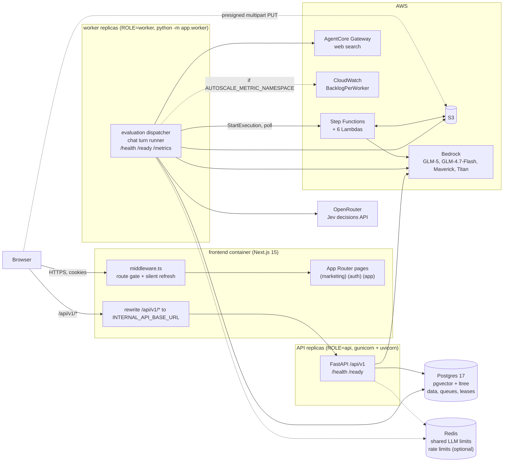
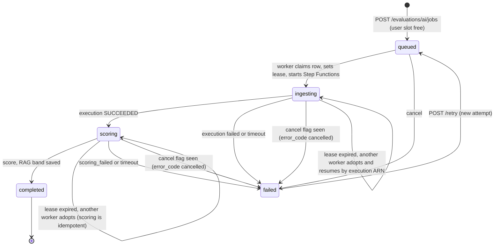
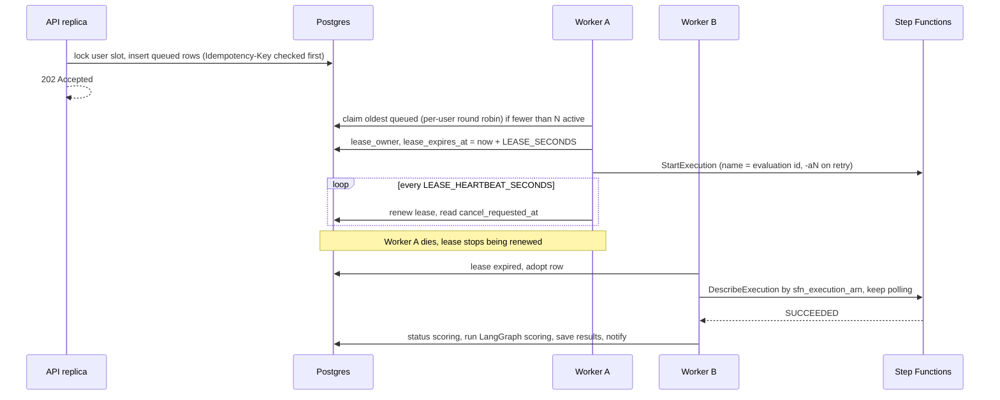
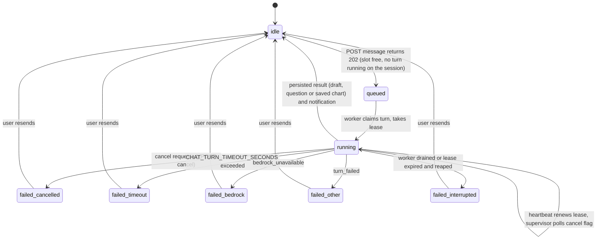
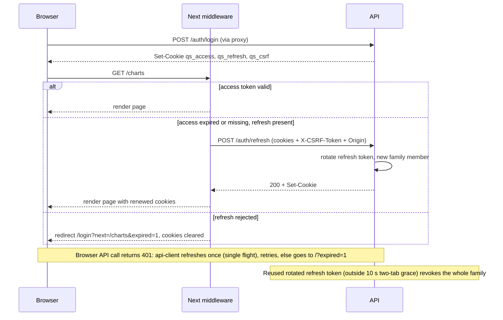
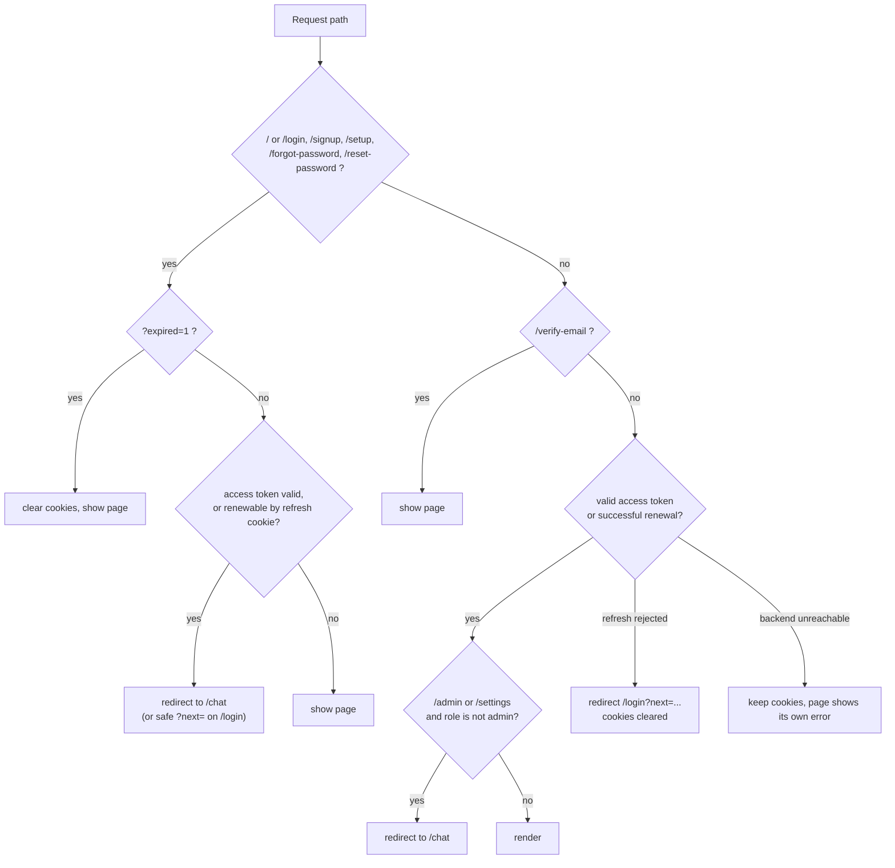
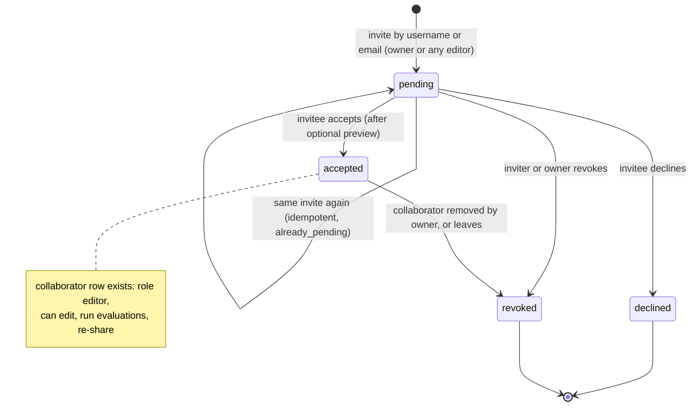
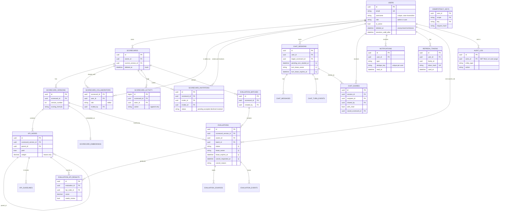
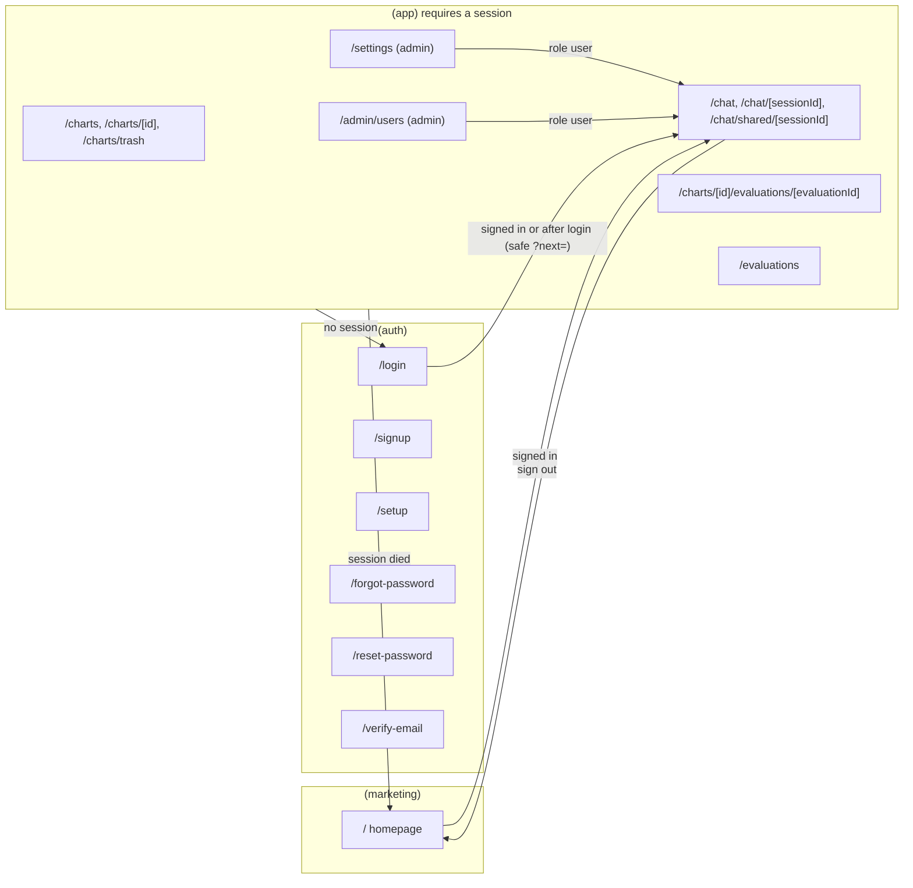

# Architecture

Score Smith (the sidebar and a few backend identifiers still say "Quality Scorecards" / `qs_*`) is a Next.js front end, a stateless FastAPI
API, one or more background workers, Postgres (the system of record and the job queue) and an optional Redis. This page
has the diagrams and short narratives; the details live next to the code:
[backend/README.md](../backend/README.md), [frontend/README.md](../frontend/README.md), [infra/README.md](../infra/README.md),
[configuration.md](configuration.md), [api-reference.md](api-reference.md), [plan-sharing-rbac.md](plan-sharing-rbac.md),
[ai-features.md](ai-features.md).

Contents: [1 System](#1-system-architecture) | [2 Evaluation lifecycle](#2-evaluation-pipeline-and-lease-lifecycle) |
[3 Chat turn](#3-chat-turn-lifecycle) | [4 Auth](#4-auth-and-refresh-flow) | [5 Sharing](#5-sharing-and-permissions) |
[6 Data model](#6-data-model) | [7 Frontend routes](#7-frontend-route-and-redirect-map) | [8 Narratives](#8-how-things-flow)

## 1. System architecture



Key points

- The browser only ever talks to the Next.js origin. `/api/v1/*` is proxied to the API, so session cookies are first-party and
  the backend URL never reaches client bundles. The API port (8000) is bound to loopback.
- API replicas are stateless and never run long jobs: they validate, write rows and answer. Workers claim queued rows
  with `SELECT ... FOR UPDATE SKIP LOCKED`, hold a *lease* on them and heartbeat it.
- Postgres is both the database and the job queue (no broker). Redis is optional and only shares *limits*
  (cluster-wide Bedrock/Jev/web-search concurrency, rate-limit counters); every Redis path **fails open** to a per-process limit.
- The whole stack runs in one process with `ROLE=all` (the default for local `uvicorn` and the test suite).

```
  browser --> [Next.js :3000] --/api/v1/*--> [API xN :8000] --> [Postgres] <-- [worker xN] --> Step Functions/Lambda/S3
                  |  middleware: auth gate                 \--> [Redis]  <---------/      \--> Bedrock, OpenRouter (Jev), AgentCore
                  \-- presigned S3 upload (browser -> S3 directly)
```

## 2. Evaluation pipeline and lease lifecycle

An evaluation row is the unit of work. `cancelled` is not a status: it is `failed` with `error_code = cancelled`.
`processing` exists in the enum but is unused.





| Mechanism | Detail |
|---|---|
| Claim | `AI_EVAL_MAX_CONCURRENT` (clamped 1-5) active evaluations cluster-wide, enforced under a Postgres advisory lock. Queued rows are ordered by (per-user rank, `queued_at`) so one user's batch cannot starve others. |
| Lease | `lease_owner`, `lease_expires_at`, `heartbeat_at` on `evaluations`. `LEASE_SECONDS=60`, heartbeat every `LEASE_HEARTBEAT_SECONDS=15`. Only an *expired* (or released) lease may be adopted, so a live owner's spend is never doubled. |
| Drain | On SIGTERM a worker stops claiming and releases its leases so another worker resumes at once. |
| Cancel | `cancel_requested_at` is a DB flag that whichever worker drives the row sees (polling loop, between KPIs). The API need not own the driver. A chart moved to the trash cancels its jobs with `cancel_reason = cancelled_by_trash`; restoring it re-queues exactly those rows when the runner's slot is free. |
| Retries | Scoring retries after transient model failures (`AI_EVAL_SCORING_RETRIES`, delays `AI_EVAL_SCORING_RETRY_DELAYS`). Manual retry only from `failed`, new `attempt`, fresh execution name. |
| Slot | At most one running evaluation job per user (a batch is one job). Derived from row state, so it cannot leak. `409 user_job_active`. |
| Timeout | `AI_EVAL_TIMEOUT_SECONDS` (default 14400) fails the row with `timeout`. |
| Idempotency | `Idempotency-Key` on job creation: a replay returns the stored result before the slot check. |

## 3. Chat turn lifecycle



- `turn_error_code` values: `bedrock_unavailable`, `timeout`, `interrupted`, `cancelled`, `turn_failed`.
- Only one running turn per user across all sessions: `409 user_chat_active`. A second message on the same session while a turn runs: `409`
  with `turn_in_progress`.
- The browser polls `GET /chat/sessions/{id}` (interim draft while running) and `/turn-events` (live trace); state is durable in Postgres,
  so a refresh or a second tab resumes. The graph state is checkpointed by LangGraph in Postgres.
- Shared recipients read the conversation and KPIs (`/chat/shared/{id}`) but cannot post.

## 4. Auth and refresh flow

Cookies: `qs_access` (httpOnly, 15 min JWT with `rol` claim), `qs_refresh` (httpOnly, opaque, rotating, session cookie unless "remember me" = 30 days),
`qs_csrf` (readable, double-submit). All `Secure` in production, `SameSite=Lax`.





Other rules: lockout after `LOCKOUT_THRESHOLD` (5) bad passwords, doubling from 5 min up to 60 min; `429` on per-IP and per-address
login limits (`RATE_LIMIT_LOGIN`, default 10/min); `POST /auth/logout` revokes the presented session and ends on `/`; admin password change,
deactivation and role change revoke every session (`users.sessions_valid_after`).

## 5. Sharing and permissions

Chart invitation (`scorecard_invitations.status`) and what happens to the collaborator row:



A declined or revoked invitation can be sent again (the unique index only covers `pending`). A pending invitee has no access except
`GET /invitations/{id}/preview`. Chat shares are separate rows (`chat_shares`): read-only, optionally with a chart invitation (`with_chart`);
recipients can pass a chat on (still read-only) and save their own copy of the draft once.

Permission matrix (404 means "does not exist" for anyone without access; admins have **no** data bypass):

| Action | Owner | Editor (accepted) | Pending invitee | Declined / revoked / removed | Other user | Admin (not shared) |
|---|---|---|---|---|---|---|
| Read chart, versions, KPIs, evaluations, activity | yes | yes | preview only | 404 | 404 | 404 |
| Edit chart, KPIs, weights, guidelines; run / cancel / retry / export evaluations | yes | yes | 404 | 404 | 404 | 404 |
| Invite further people (re-share) | yes | yes | 404 | 404 | 404 | 404 |
| Revoke invitations / remove collaborators | any | only invitations they sent, else 403 `owner_only` | 404 | 404 | 404 | 404 |
| Delete chart | moves to trash | leaves the chart (204) | 404 | 404 | 404 | 404 |
| Trash: list, restore, purge | yes | no | no | no | no | no |
| Chat sessions | private to its user (always, admins too); read-only via chat share | | | | | |
| `/admin/users*`, Users and Settings pages | admin only (403 for users) | | | | | |

Concurrent edits: `PATCH` accepts `If-Match: <updated_at>`; a mismatch is `409 stale_edit` with the current `updated_at`.

## 6. Data model

Main tables only (all primary keys are UUIDs except `scorecard_activity.id`; "Q" = columns that make the row a queue item / lease).



Not drawn: `kpi_guidelines` columns, `password_reset_tokens`, `oauth_identities` (all `user_id` FKs), `evaluation_sources`, `evaluation_events`,
`chat_messages`, `chat_turn_events`, `scorecard_embeddings`, LangGraph checkpoint tables (created by `python -m app.scripts.migrate`).
`idempotency_keys.user_id` has no foreign key. Column-level detail: [data_dictionary.md](data_dictionary.md).

Migrations: `0001`..`0010` foundation, chat, AI evaluation; `0011_scaling_leases` (leases, cancel flags, chat-turn queue, `idempotency_keys`);
`0012_auth_ownership` (passwords, tokens, `evaluations.owner_id`, audit context); `0013_sharing_rbac` (usernames, collaborators, invitations, activity,
notifications, two roles, list indexes); `0014_chat_shares`; `0015_chart_trash` (`scorecards.deleted_at/deleted_by`); `0016_eval_cancel_reason`.

## 7. Frontend route and redirect map



## 8. How things flow

**A request.** The browser calls `/api/v1/...` on the Next.js origin with cookies. For unsafe methods the client adds `X-CSRF-Token` (copy of
`qs_csrf`). Next rewrites it to an API replica. `get_current_user` verifies the access JWT (cookie or `Authorization: Bearer`), checks the
CSRF header and the `Origin`, loads the user, and endpoints load every resource through owner/collaborator-scoped helpers in `app/authz.py`
(404 on miss). Rate limits are dependencies (per IP for auth routes, per user for expensive ones). Responses carry `X-Request-ID`, which is also
stored on audit rows.

**An evaluation.** (1) The browser uploads files straight to S3 with presigned multipart URLs (or sends Drive links / a spreadsheet to be parsed).
(2) `POST /evaluations/ai/jobs` takes the user's slot under an advisory lock, inserts `queued` rows and returns 202. (3) A worker claims a row,
leases it and starts a Step Functions execution; Lambdas download, extract, transcribe and OCR into `derived/{id}/corpus.json`. (4) On success
the same worker scores locally (LangGraph: identify, evidence, Jev score, reasoning), writes `evaluation_kpi_results`, the weighted score and RAG
band, and creates notifications. (5) The UI polls `GET /evaluations/{id}/progress`; the list uses `GET /evaluations/page` + `POST /evaluations/refresh`.
If the worker dies, another adopts the row after the lease expires. Details: section 2 and [ai-features.md](ai-features.md).

**A chat turn.** `POST /chat/sessions/{id}/messages` claims the user's chat slot and the session marker in one transaction, stores the message
and returns 202. A worker claims the turn, runs the LangGraph builder (mode detection, category research with web search, Jev quality gates,
guideline writing), streams trace events to `chat_turn_events`, and persists the draft or question. Confirming the draft materialises scorecard,
version, KPI nodes and guidelines. The UI polls the session and its trace. Details: section 3.
