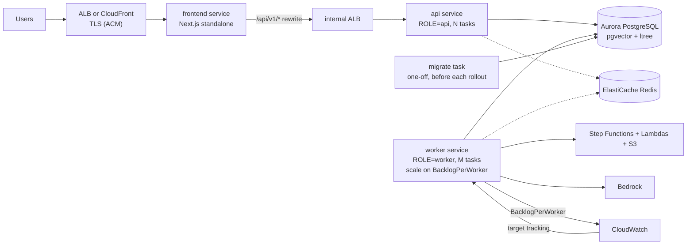

# Cloud deployment plan: Score Smith

Status: **planning only. Nothing in this document is provisioned.** It describes how to move the local Docker Compose stack
([infra/README.md](../infra/README.md)) to AWS, written against the current architecture ([architecture.md](architecture.md)): a stateless
**api** tier, a separate **worker** tier, **Postgres** as database and job queue, optional **Redis**, a **migrate** release job, and the existing serverless
evaluation stack in [`aws/`](../aws/README.md). All variables referenced here are documented in [configuration.md](configuration.md).

## 1. Current state and gaps

| Component | Local today | Gap for the cloud |
|---|---|---|
| Database | `pgvector/pgvector:pg17` container, volume `qs_pg_data`, no managed backups | Managed Postgres with PITR and Multi-AZ failover |
| API | `ROLE=api`, gunicorn + uvicorn, bind-mounted source | Immutable image, health-checked, horizontally scaled behind a load balancer |
| Workers | `ROLE=worker`, one replica, bind-mounted source | Long-running tasks (evaluations up to 4 h), SIGTERM drain, autoscaling on backlog |
| Migrations | `migrate` compose service (`python -m app.scripts.migrate`) | A release step that runs once before the new api / workers start |
| Redis | `redis:7-alpine`, no persistence, no host port | Managed Redis, private subnet (or none: limits fail open) |
| Frontend | `next dev` with bind mounts | A real `next build` image |
| Secrets | plaintext `infra/.env` | Secrets Manager / SSM, no keys in images or the repo |
| Network | loopback host ports, no TLS | TLS, private data tier, trusted-proxy settings |
| CI/CD | CI exists (`.github/workflows/backend-ci.yml`, `frontend-ci.yml`: tests, lint, build) | No image build, no deploy, no migration step |

## 2. Target topology

Why the split matters for hosting: a worker has **no inbound HTTP** and runs jobs for minutes to hours. Platforms that scale on requests (App Runner) are a poor fit
for it. Recommendation: **ECS on Fargate** for `api`, `worker` and `frontend` (three services, one cluster), ALB in front, ECR for images.
EKS is not justified for three services. App Runner remains acceptable for the *frontend only* if you prefer it, but keeping one platform is simpler.

## 3. Database: Aurora PostgreSQL

Target: Aurora PostgreSQL 17.x (Provisioned or Serverless v2), one writer and at least one reader/standby.

1. **Extension parity first.** The schema needs `vector` (pgvector, 1024-dim Titan embeddings) and `ltree` (`kpi_nodes.path`), created by migration `0001`. In a sandbox cluster run
   `SELECT name, default_version FROM pg_available_extensions WHERE name IN ('vector','ltree');` and then `python -m app.scripts.migrate` end to end.
2. **Run the test suite against it** by pointing `TEST_DATABASE_URL` at a throwaway database on the cluster (the suite truncates tables: never the real database).
3. **Connection budget.** Each api/worker process opens up to `DB_POOL_SIZE + DB_MAX_OVERFLOW` (default 5 + 10) connections. Size `max_connections` for
   `processes x 15` (gunicorn `WEB_CONCURRENCY` workers per api task, plus workers), or put RDS Proxy in front. Workers hold advisory locks and long-lived transactions only briefly.
4. **Migration of existing data**: `pg_dump -Fc` / `pg_restore` (see [infra/README.md](../infra/README.md#backups-and-restore)) for small volumes; AWS DMS only if downtime must be minimal.
   LangGraph checkpoint tables are in the same database and travel with the dump.
5. **Backups**: automated backups with PITR, 14-35 day retention. The trash purge and the lease protocol are idempotent, so restoring a snapshot is safe: workers simply adopt or re-run active rows.

## 4. Redis (ElastiCache)

Redis only holds disposable state: the cluster-wide Bedrock / Jev / web-search slot semaphores, the shared AIMD limiter and rate-limit counters. Set `REDIS_URL` to the cluster endpoint
(`rediss://` for in-transit encryption). If Redis is unreachable the code **fails open** to per-process limits (rate limits to in-memory), and `/ready` reports `redis: down` without failing, so a Redis outage
degrades fairness, not availability. No persistence or backups are needed. Set `BEDROCK_GLOBAL_CONCURRENCY` to your account's Bedrock concurrency budget so the sum over all workers stays inside it.

## 5. Images, release job and rollout

- **Backend image**: the existing `backend/Dockerfile` is already production-shaped (no `--reload`, gunicorn with `--graceful-timeout 30`). One image serves three roles via command and `ROLE`:
  `api` (default CMD), `worker` (`python -m app.worker`), `migrate` (`python -m app.scripts.migrate`). Do not bind-mount source in the cloud.
- **Frontend image**: needs a multi-stage production build (`next build`, `output: "standalone"`, `next start`); today's Dockerfile is dev-mode. `INTERNAL_API_BASE_URL` is read at runtime by the server
  (rewrites, middleware, Server Components); point it at the internal API load balancer. The browser never sees it.
- **Release order**: build and push images (tag = git SHA) -> run the `migrate` task to completion (non-zero exit blocks the rollout) -> update `api`, then `worker`, then `frontend` services.
  Migrations are additive-only so the previous image keeps working while a rollout is in flight.
- **Worker shutdown**: ECS `stopTimeout` must exceed `WORKER_DRAIN_GRACE_SECONDS` (20 s) plus lease release; set it to 60-120 s (compose uses 60 s). On SIGTERM a worker stops claiming, lets chat turns finish, cancels
  the rest (recorded `interrupted`) and releases evaluation leases so a peer resumes them at once. Evaluations that were mid-flight are resumed by Step Functions execution ARN, not restarted.
- **Health checks**: api target group on `GET /ready`; worker container health check on `GET :8001/health`; `/ready` of the worker is for readiness-style probes.
- **Trusted proxy**: set `FORWARDED_ALLOW_IPS` to the load balancer's subnets so per-IP rate limits and the audit log see real client addresses.

## 6. Autoscaling on backlog per worker

Signal: `backlog_per_worker = (queued + active evaluations + waiting chat turns) / live workers` (`app/metrics.py`).

- Set `AUTOSCALE_METRIC_NAMESPACE` (for example `ScoreSmith`) and `AUTOSCALE_METRIC_INTERVAL_SECONDS`; workers publish `BacklogPerWorker` to CloudWatch (one publisher per interval when Redis is available) and log it as JSON.
  The task role needs `cloudwatch:PutMetricData`.
- Application Auto Scaling **target tracking** on that metric for the worker service (for example target 2 backlog per worker, min 1, max bounded by the Bedrock quota and `AI_EVAL_MAX_CONCURRENT`).
  Scale in slowly (long cooldown): leases make it safe, but a drained task wastes in-flight work.
- Workers turn on **ECS task scale-in protection** while they hold evaluations or chat turns, so scale-in never picks a busy task. The task role needs `ecs:UpdateTaskProtection`.
- Remember the ceilings: `AI_EVAL_MAX_CONCURRENT` (1-5) is cluster-wide, each user has one running evaluation job and one chat turn, and Lambda/Bedrock quotas apply. More workers raise chat-turn capacity
  (`CHAT_TURN_MAX_CONCURRENT` each) and recovery speed, not evaluation throughput beyond the cap.
- The api tier scales on CPU / request count as usual; it is stateless.

## 7. Secrets management

| Secret | Where | Notes |
|---|---|---|
| `JWT_SECRET`, `BOOTSTRAP_TOKEN` (first run only) | Secrets Manager, injected as ECS `secrets:` | Never in images or task-definition plaintext |
| Database URL / password | Secrets Manager (Aurora-managed rotation) | `DATABASE_URL` assembled at deploy time; password 12+ random characters (production validation) |
| Bedrock credential | Prefer the **task IAM role** (`bedrock:InvokeModel` / `Converse` on the named model ARNs) | Removes the long-term key and the `AWS_BEARER_TOKEN_BEDROCK` workaround; verify boto3 picks up the role (drop the compose-only bearer line) |
| `OPENROUTER_JEV_API` | Secrets Manager | Jev is an OpenRouter alpha API |
| `AGENTCORE_GATEWAY_AWS_*` | Secrets Manager | Separate principal, hand-signed SigV4 |
| `AWS_APP_ACCESS_KEY_ID` / `_SECRET` | Prefer the task role with the policy from `aws/policies/backend-user-policy.json`; otherwise Secrets Manager | S3 and Step Functions only |
| OAuth client secrets | Secrets Manager | Optional |

Non-secret settings (`ENV=production`, `ROLE`, `CORS_ORIGINS`, `FRONTEND_URL`, model ids, limits) go in task-definition environment variables. `Settings` needs no code change: it reads the environment.
`ENV=production` makes api and worker refuse to boot with weak secrets (list in [configuration.md](configuration.md#production-validation)), and requires `EMAIL_BACKEND=ses` (verify the sender domain in SES, `EMAIL_FROM`).

## 8. TLS, domain, cookies

Route 53 + ACM certificates on the ALB (or CloudFront). Set `FRONTEND_URL` and `CORS_ORIGINS` to the exact public https origin (production validation rejects localhost and `*`), `OAUTH_REDIRECT_BASE` if OAuth is used,
and the S3 bucket CORS origin (`aws/bootstrap --cors-origin`). Cookies become `Secure` automatically; the frontend sends HSTS in production builds. Because the browser calls the frontend origin and Next proxies `/api/v1/*`, there is
no cross-site cookie problem and `COOKIE_DOMAIN` can stay empty. The API itself never needs to be public: keep it on an internal load balancer.

## 9. CI/CD

Existing: backend CI (Postgres + Redis services, migrations, `pytest`, `ruff`) and frontend CI (`tsc`, lint, unit tests, build). To add:

1. On merge to `main`: build both images, tag with the SHA, push to ECR, scan.
2. Run the `migrate` task (`aws ecs run-task`) and wait for exit code 0.
3. Deploy `api`, `worker`, `frontend` task definitions; rely on ECS deployment circuit breaker for rollback.
4. First production deploy only: set `BOOTSTRAP_TOKEN`, create the admin with `POST /api/v1/auth/register-user`, then remove the token.

## 10. Infrastructure as code and sequencing

Terraform (or CDK) for: Aurora, ElastiCache, ECR, ECS cluster + three services, ALBs, Secrets Manager, task roles, Route 53/ACM, CloudWatch alarms (5xx, `BacklogPerWorker`, worker unhealthy), AWS Budgets.
The serverless evaluation stack is already scripted in `aws/` (idempotent bootstrap); keep it as is or port it to the same IaC later.

Suggested order: (1) Aurora extension/version check; (2) IaC skeleton in a sandbox account; (3) production frontend Dockerfile; (4) image build/push in CI; (5) sandbox deploy of api + worker + migrate, smoke test (sign in,
create a chart via chat, run an evaluation, kill a worker mid-run and watch another adopt it); (6) TLS/domain, autoscaling on `BacklogPerWorker`; (7) cut over.
